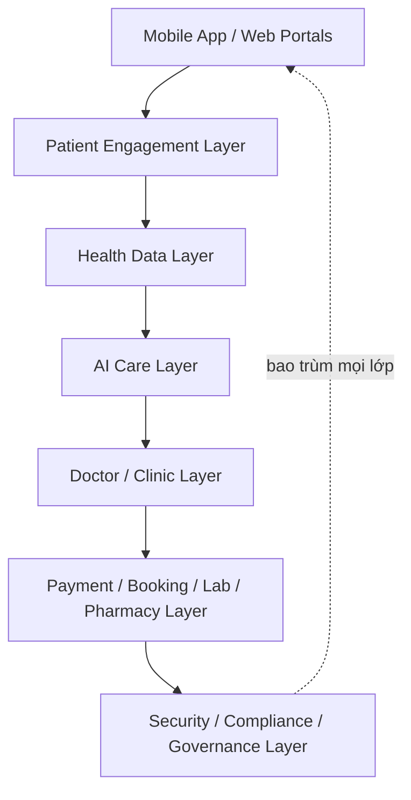
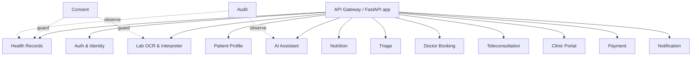
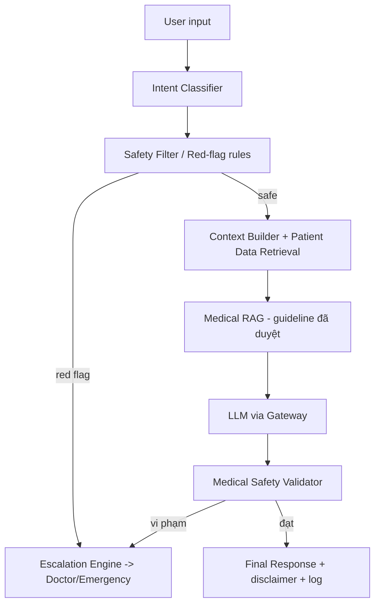

# Architecture Doctrine — MetoCare (MCP)

> Tài liệu học thuyết kiến trúc tổng thể. Đây là tài liệu "luật gốc" của dự án. Mọi quyết định kỹ thuật, sản phẩm và AI về sau phải nhất quán với các nguyên tắc trong file này. Khi có xung đột, doctrine thắng.

---

## 1. Purpose

Thiết lập bộ nguyên tắc kiến trúc bất biến (architecture principles) và các quyết định nền tảng (foundational decisions) cho MetoCare — nền tảng quản lý sức khỏe chuyển hóa cá nhân hóa kết hợp tracking, AI care và kết nối bác sĩ/phòng khám.

Tài liệu này dùng để:

- Định hướng cho CTO, Tech Lead, kiến trúc sư khi thiết kế hệ thống.
- Làm chuẩn để review mọi PR/đề xuất tính năng: "có vi phạm doctrine không?".
- Bảo vệ ranh giới y tế–AI–pháp lý ngay từ tầng kiến trúc, không phải bằng văn bản hứa hẹn.

## 2. Context

MCP **không phải** một app wellness ghi chép chỉ số. Nó là nền tảng quản lý bệnh mạn tính chuyển hóa (tiền tiểu đường / tiểu đường type 2, béo phì/vòng bụng cao, rối loạn mỡ máu, tăng huyết áp, gan nhiễm mỡ, hội chứng chuyển hóa). Hệ quả kiến trúc:

- Dữ liệu sức khỏe = dữ liệu cá nhân nhạy cảm (Luật Bảo vệ dữ liệu cá nhân Việt Nam hiệu lực 01/01/2026). Bảo mật và consent là yêu cầu pháp lý, không phải tính năng.
- AI chạm tới quyết định sức khỏe → rủi ro cao. Phải có guardrail cứng ở tầng kiến trúc.
- Sản phẩm phải sống được 5+ năm và mở rộng thành care platform, nên kiến trúc phải "MVP-nhỏ nhưng scale được".

### Product Vision

> "Lớp chăm sóc sức khỏe liên tục giữa các lần gặp bác sĩ."

MCP giúp người có bệnh chuyển hóa: (1) biết mình đang ở rủi ro nào qua Metabolic Score dễ hiểu; (2) làm đúng việc mỗi ngày qua AI lifestyle coach tiếng Việt; (3) phát hiện sớm tín hiệu xấu qua triage; (4) kết nối đúng bác sĩ/phòng khám khi cần, với dữ liệu được chuẩn bị sẵn. AI là lớp chăm sóc liên tục — **không thay thế bác sĩ**.

## 3. Decision / Scope

### 3.1 Architecture Principles (bất biến)

| # | Nguyên tắc | Phát biểu cứng |
|---|-----------|----------------|
| P1 | **Modular Monolith First** | MVP là một deployable backend duy nhất, chia module nội bộ rõ ràng. Không microservices cho tới khi có lý do scale/độc lập triển khai rõ ràng. |
| P2 | **API-First Design** | Mọi module expose qua API contract (OpenAPI) trước khi viết UI. Mobile, Doctor Portal, Admin Portal đều là client của cùng một API. |
| P3 | **Security-by-Design** | Phân quyền, mã hóa, audit là tầng bắt buộc trong mọi luồng dữ liệu sức khỏe, được thiết kế từ schema chứ không bolt-on sau. |
| P4 | **Privacy-by-Design** | Thu thập tối thiểu, consent rõ phạm vi, dữ liệu thuộc về người dùng. Mọi truy cập dữ liệu bệnh nhân phải gắn với một consent hợp lệ. |
| P5 | **AI-Safety-by-Design** | AI bị chặn bằng guardrail cứng (rule engine) trước và sau LLM. AI không tự chẩn đoán khẳng định, không kê đơn, không đổi liều thuốc. |
| P6 | **Doctor-in-the-Loop** | Mọi nội dung mang tính lâm sàng (care plan, kết luận, thay đổi điều trị) phải do bác sĩ tạo/duyệt. AI chỉ chuẩn bị và giải thích. |
| P7 | **Human Escalation** | Khi phát hiện red flag, hệ thống phải có đường escalate sang bác sĩ/cấp cứu, không để AI "tự xử lý". |
| P8 | **Data Ownership** | Người dùng sở hữu dữ liệu của mình: xem, xuất, yêu cầu xóa. Phòng khám/bác sĩ chỉ truy cập trong phạm vi consent. |
| P9 | **Auditability** | Mọi truy cập và mọi hành động AI lên dữ liệu sức khỏe đều phải ghi audit log không thể sửa. |
| P10 | **Observability** | Hệ thống phải quan sát được: logging có cấu trúc, metrics, tracing, error monitoring — kể cả AI pipeline. |
| P11 | **Build-for-MVP-but-Scale-Later** | Chọn công nghệ cho phép tách service/scale theo chiều ngang về sau mà không phải viết lại (module boundary rõ, stateless services, time-series tách riêng). |

### 3.2 Foundational Technology Decisions (CHỐT)

| Lĩnh vực | Quyết định | Vai trò |
|---------|-----------|---------|
| Mobile | **Flutter** | App bệnh nhân iOS + Android, UI mượt, biểu đồ tốt, một codebase. |
| Web Portals | **Next.js (React) + Tailwind** | Doctor Portal, Clinic Admin Portal, Internal Admin Portal. |
| Backend | **FastAPI (Python)** | Modular monolith. Python thuận cho AI/OCR/rule engine. |
| Database chính | **PostgreSQL** | Transactional core data, RBAC, consent, audit. |
| Time-series | **TimescaleDB** (extension trên Postgres) | Health metrics (huyết áp, đường huyết, cân nặng...) theo thời gian. |
| Cache/Queue | **Redis** | Cache, session, rate-limit, background job queue. |
| Object storage | **S3 / MinIO** | File xét nghiệm (ảnh/PDF), báo cáo, ảnh bữa ăn. |
| Vector DB | **pgvector** (MVP) → **Qdrant** (khi scale RAG) | Medical RAG / semantic search. |
| AI access | **LLM Gateway** (lớp abstraction nội bộ) | Tách provider (OpenAI/Gemini/Claude), gắn guardrail, logging, fallback. |

**Lý do chọn TimescaleDB là extension của Postgres thay vì DB riêng:** giữ một hệ quản trị, một backup/restore, join được giữa metric và core data; vẫn tách hypertable để scale ghi/đọc time-series. Tránh thêm vận hành phức tạp ở MVP.

**Lý do bắt buộc LLM Gateway:** không gọi thẳng LLM provider từ business code. Mọi prompt phải đi qua gateway để (a) gắn safety prompt + guardrail, (b) ghi AI log để review, (c) đổi provider không sửa code nghiệp vụ, (d) áp rate-limit/cost control.

### 3.3 Bảy lớp chức năng

## 4. Detailed Design / Requirements

### 4.1 Modular Monolith — ranh giới module

Backend là một deployable, nhưng chia module nội bộ với ranh giới rõ; module chỉ giao tiếp qua interface công khai (service layer), không truy cập thẳng bảng của module khác.

**Quy tắc:** module Consent và Audit là cross-cutting — mọi truy cập dữ liệu bệnh nhân phải đi qua Consent check và để lại Audit record.

### 4.2 API-First

- Mọi endpoint định nghĩa bằng OpenAPI trước. Contract review trước khi code.
- Versioning theo `/api/v1`. Breaking change → version mới, không sửa contract đang chạy.
- Client (Flutter, Next.js) sinh từ contract; không hardcode shape ngoài contract.

### 4.3 AI-Safety-by-Design (chốt ở tầng kiến trúc)

AI **không bao giờ** là một lời gọi LLM trần. Pipeline bắt buộc:

Chi tiết allowed/prohibited/escalation nằm ở `AI_Safety_Guardrail.md`. Doctrine chỉ chốt: **rule engine bao quanh LLM ở cả input và output; không có đường đi nào của AI mà không qua guardrail.**

### 4.4 Data Ownership & Consent

- Mỗi truy cập đọc dữ liệu bệnh nhân bởi bác sĩ/phòng khám phải resolve được tới một `Consent` còn hiệu lực với đúng `data_scope`.
- Người dùng có quyền: xem nhật ký ai đã xem dữ liệu, thu hồi consent, yêu cầu xuất/xóa dữ liệu.

## 5. Out of Scope (KHÔNG làm ở giai đoạn đầu)

| Không làm | Lý do |
|-----------|-------|
| **Microservices sớm** | Tăng chi phí vận hành/độ phức tạp khi chưa có tải. Modular monolith đủ và scale được. |
| **AI diagnosis (chẩn đoán khẳng định)** | Rủi ro pháp lý/y khoa; có thể bị xếp là thiết bị y tế. AI chỉ explain + triage. |
| **AI prescription (kê đơn)** | Vượt ranh giới hành nghề y. Tuyệt đối cấm. |
| **Tự động đổi liều thuốc** | Nguy hiểm trực tiếp tới bệnh nhân. Cấm. |
| **Tích hợp HIS/EMR sâu ngay MVP** | Tốn kém, phụ thuộc đối tác; chỉ cần PDF/CSV, FHIR-lite về sau. |
| **Marketplace bác sĩ quá rộng** | Mất tập trung; MVP chỉ cần 3–5 phòng khám đối tác. |
| **Bán thuốc / insurance claim / corporate wellness phức tạp** | Ngoài phạm vi MVP, mở ở Phase 2–3. |

## 6. Risks

| Rủi ro | Mức | Giảm thiểu (cơ chế) |
|--------|-----|---------------------|
| AI trả lời vượt ranh giới y khoa | Cao | Guardrail rule engine 2 đầu; medical validator; log + review; cấm kê đơn ở code path. |
| Rò rỉ dữ liệu sức khỏe | Cao | Mã hóa at-rest/in-transit, RBAC, field-level encryption, audit log, consent gate. |
| Modular monolith biến thành "big ball of mud" | Trung bình | Ép ranh giới module qua service layer + review; cấm cross-module DB access. |
| Khóa cứng vào 1 LLM provider | Trung bình | LLM Gateway abstraction. |
| Time-series phình to làm chậm core DB | Trung bình | Tách hypertable TimescaleDB, retention policy, continuous aggregates. |
| Doctrine bị bỏ qua khi chạy nước rút | Trung bình | Checklist doctrine trong Definition of Done của mọi sprint. |

## 7. Acceptance Criteria

- [ ] Có ADR (Architecture Decision Record) cho từng quyết định ở mục 3.2.
- [ ] Mọi module backend có ranh giới rõ; không có truy cập chéo bảng giữa các module.
- [ ] Không tồn tại code path nào gọi LLM mà bỏ qua LLM Gateway + guardrail.
- [ ] Mọi endpoint đọc dữ liệu bệnh nhân đều qua Consent check và sinh Audit record.
- [ ] Checklist "doctrine compliance" được thêm vào Definition of Done.
- [ ] CTO/Tech Lead ký duyệt 11 nguyên tắc P1–P11 là bất biến.

## 8. Next Steps

1. Tạo repo ADR (`/docs/adr/`) và ghi ADR-001 → ADR-009 cho các quyết định công nghệ.
2. Triển khai `Technical_Architecture.md` thành thiết kế chi tiết module và API contract.
3. Khởi động Sprint 0 theo `Sprint0_Execution_Blueprint.md`.
4. Thành lập Hội đồng chuyên môn (medical board) để duyệt guardrail và RAG content.
