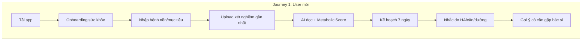
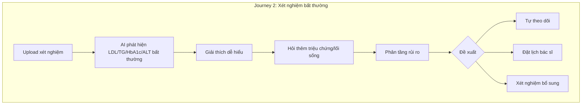
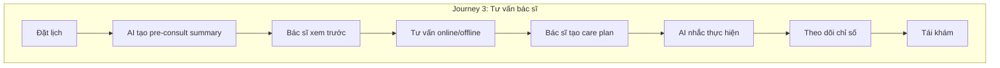

# Business Requirement Document (BRD) — MetoCare

> Tài liệu yêu cầu nghiệp vụ cho nền tảng quản lý sức khỏe chuyển hóa. Dùng để thống nhất giữa Founder, Product, BA, kỹ thuật và đối tác y tế về vấn đề kinh doanh, người dùng, phạm vi, yêu cầu chức năng/phi chức năng, quy tắc, an toàn y tế và tiêu chí thành công.

---

## 1. Purpose

Định nghĩa "xây cái gì và vì sao" cho MCP ở mức nghiệp vụ, làm nguồn duy nhất cho phạm vi MVP và roadmap. BRD này ràng buộc các tài liệu kỹ thuật phía sau (technical architecture, data model, AI safety, security).

## 2. Context

### 2.1 Executive Summary

MCP là nền tảng quản lý bệnh mạn tính chuyển hóa, không phải app wellness ghi chép chỉ số. Giá trị cốt lõi: biết người dùng đang ở rủi ro nào (Metabolic Score), nhắc làm đúng việc mỗi ngày (AI lifestyle coach tiếng Việt), phát hiện sớm tín hiệu xấu (triage), và kết nối đúng bác sĩ/phòng khám với dữ liệu chuẩn bị sẵn. MVP tập trung: **Health Tracking + Lab AI Interpretation + Lifestyle Coach + Doctor Booking + Doctor Portal**, làm sâu nhóm bệnh tiền tiểu đường/rối loạn chuyển hóa/béo bụng/mỡ máu. **AI không thay bác sĩ** — AI là lớp chăm sóc liên tục giữa các lần khám.

### 2.2 Business Problem

- Người có bệnh chuyển hóa ở Việt Nam thiếu công cụ theo dõi liên tục, hiểu được kết quả xét nghiệm và biết khi nào cần gặp bác sĩ. Dữ liệu sức khỏe rời rạc, không liên tục.
- Bác sĩ thiếu dữ liệu trước khi khám và không theo dõi được bệnh nhân sau khám → hiệu quả điều trị thấp, tái khám kém.
- App đặt lịch hiện có chỉ "book bác sĩ", không tạo dữ liệu trước khám và không hỗ trợ tuân thủ sau khám — đây là khoảng trống thị trường.
- Bệnh chuyển hóa là nhóm đủ lớn, đủ đau, đủ khả năng chi trả, và phù hợp để AI hỗ trợ mà không vượt ranh giới y khoa.

## 3. Decision / Scope

### 3.1 Target Users & Personas

| Persona | Mô tả | Nhu cầu chính |
|---------|-------|---------------|
| **Người tiền tiểu đường** | Đường huyết ranh giới, lo tiến triển tiểu đường. | Theo dõi đường huyết/HbA1c, hiểu nguy cơ, coaching giảm carb, biết khi nào gặp bác sĩ. |
| **Người béo bụng / rối loạn mỡ máu** | Vòng bụng cao, lipid bất thường. | Theo dõi cân nặng/vòng bụng/lipid, coaching dinh dưỡng, Metabolic Score. |
| **Người tăng huyết áp** | HA cao, cần kiểm soát. | Theo dõi HA, nhắc đo, cảnh báo bất thường, theo dõi natri/giấc ngủ. |
| **Người gan nhiễm mỡ** | Men gan tăng, gan nhiễm mỡ. | Theo dõi cân nặng/men gan, giảm đường/rượu, coaching lối sống. |
| **Bác sĩ nội tiết/tim mạch/dinh dưỡng/gan mật** | Bác sĩ điều trị bệnh chuyển hóa. | Xem hồ sơ + AI summary trước khám, ghi tư vấn, tạo care plan, theo dõi sau khám, ít thao tác. |
| **Phòng khám** | Cơ sở cung cấp dịch vụ. | Quản lý bác sĩ/lịch/booking/gói/doanh thu/SLA, nhận bệnh nhân từ app. |
| **Admin vận hành nền tảng** | Đội vận hành MCP. | Quản lý user/bác sĩ/phòng khám/booking, xem AI logs, dashboard, audit. |

### 3.2 Business Objectives

- Chứng minh người dùng dùng app hằng tuần và bác sĩ thấy hữu ích (MVP).
- Xây nền để chuyển thành chương trình chăm sóc 90 ngày có kết quả đo được (Phase 2).
- Mở đường B2B/B2B2C (doanh nghiệp, bảo hiểm, phòng khám, lab) với unit economics lành mạnh.

### 3.3 Product Objectives

- Cho người dùng một bức tranh sức khỏe chuyển hóa dễ hiểu (Metabolic Score) thay vì hàng chục chỉ số rời rạc.
- Giảm ma sát nhập liệu (chụp ảnh xét nghiệm/bữa ăn, chọn nhanh, sync) để giữ chân.
- Doctor handoff mượt: AI chuẩn bị summary, bác sĩ ít thao tác, care plan được AI nhắc thực hiện.
- An toàn y tế tuyệt đối: AI không chẩn đoán khẳng định/không kê đơn/không đổi liều; có triage và escalation.

### 3.4 In-scope (MVP)

Onboarding & health profile; health tracking + dashboard + cảnh báo; lab upload/OCR + AI lab interpretation; metabolic score (bản đầu); nutrition logging đơn giản + AI lifestyle coach; triage + risk alert; doctor booking; doctor portal (summary, note, care plan đơn giản, chat); clinic/admin quản lý cơ bản; consent + audit; notification; payment booking/subscription cơ bản; report export PDF.

### 3.5 Out-of-scope (MVP)

Kết nối nhiều thiết bị; marketplace bác sĩ rộng; AI diagnosis nâng cao; bán thuốc; tích hợp sâu HIS/EMR; insurance claim; corporate wellness phức tạp; microservices; care program đầy đủ (mở Phase 2).

## 4. Detailed Design / Requirements

### 4.1 Functional Requirements

| ID | Nhóm | Yêu cầu |
|----|------|---------|
| FR-01 | Onboarding | Đăng ký, xác thực, nhập bệnh nền/mục tiêu, đồng ý consent rõ phạm vi. |
| FR-02 | Health profile | Hồ sơ: tuổi, giới, chiều cao/cân nặng/vòng bụng, bệnh nền, dị ứng, tiền sử, lifestyle; family profile (sau). |
| FR-03 | Health tracking | Nhập tay/sync chỉ số: cân nặng, BMI, vòng bụng, huyết áp, đường huyết, HbA1c, lipid, men gan, chức năng thận, tuyến giáp, thuốc, vận động, giấc ngủ, triệu chứng. Biểu đồ 7/30/90/365 ngày. |
| FR-04 | Lab upload/OCR | Upload ảnh/PDF xét nghiệm → OCR → trích kết quả, lưu hồ sơ theo thời gian, có confidence + verify. |
| FR-05 | AI lab interpretation | AI giải thích kết quả dễ hiểu, nêu chỉ số bất thường (LDL/TG/HbA1c/ALT...), gợi ý bước tiếp theo. **Không chẩn đoán khẳng định.** |
| FR-06 | Metabolic score | Điểm sức khỏe chuyển hóa 0–100 + mức rủi ro + top risks + suggested actions. |
| FR-07 | Nutrition logging | Ghi bữa ăn: chụp ảnh + chọn nhanh (cơm/bún/phở/bánh mì/đồ chiên/đồ ngọt), AI ước lượng rủi ro thấp/vừa/cao. |
| FR-08 | AI lifestyle coach | Gợi ý thay đổi nhỏ theo ngữ cảnh (giảm 1/2 bát cơm, bỏ nước ngọt, đi bộ sau ăn). **Chỉ khuyến nghị lối sống, không phác đồ điều trị.** |
| FR-09 | Triage | Phát hiện red flag, phân tầng rủi ro 4 mức, escalate bác sĩ/cấp cứu khi cần. |
| FR-10 | Doctor booking | Tìm bác sĩ/phòng khám theo chuyên khoa, đặt lịch online/offline, gửi hồ sơ trước, thanh toán, đánh giá. |
| FR-11 | Doctor portal | Bác sĩ xem hồ sơ đã consent, AI summary, chỉ số/biểu đồ, xét nghiệm, thuốc, triệu chứng; ghi consultation note; tạo care plan đơn giản; đề xuất xét nghiệm; chat follow-up. |
| FR-12 | Clinic admin | Quản lý bác sĩ, lịch, booking, bệnh nhân từ app, gói chăm sóc, doanh thu, SLA. |
| FR-13 | Care plan | Bác sĩ tạo care plan; AI nhắc thực hiện hằng ngày; theo dõi adherence. |
| FR-14 | Notification | Nhắc đo chỉ số, lịch hẹn, cảnh báo bất thường, weekly health report qua push/SMS/Zalo/Email. |
| FR-15 | Payment | Thanh toán booking + subscription; trạng thái giao dịch; hóa đơn. |
| FR-16 | Report export | Xuất báo cáo PDF cho bác sĩ. |
| FR-17 | Admin dashboard | Quản lý user/bác sĩ/phòng khám/booking, AI logs, dashboard vận hành, audit log. |

### 4.2 Non-Functional Requirements

| ID | Loại | Yêu cầu (cơ chế) |
|----|------|------------------|
| NFR-01 | Security | Mã hóa at-rest/in-transit, RBAC, field-level encryption cho dữ liệu nhạy cảm, secret manager. |
| NFR-02 | Privacy | Consent rõ phạm vi, thu thập tối thiểu, quyền xuất/xóa dữ liệu, data ownership thuộc người dùng. |
| NFR-03 | Performance | API p95 < 500ms cho thao tác phổ biến; biểu đồ tải nhanh qua continuous aggregate; AI có streaming. |
| NFR-04 | Scalability | Backend stateless scale ngang; time-series hypertable; module bóc tách được. |
| NFR-05 | Availability | MVP mục tiêu ≥ 99.5%; DB có backup + PITR; provider ngoài có fallback. |
| NFR-06 | Auditability | Mọi truy cập/hành động AI lên dữ liệu sức khỏe ghi audit log không sửa được. |
| NFR-07 | Maintainability | Modular monolith ranh giới rõ, typed code, test, OpenAPI contract. |
| NFR-08 | Observability | Structured log (no PHI), metrics, tracing, error monitoring gồm AI pipeline. |

### 4.3 Business Rules

- BR-01: Bác sĩ chỉ truy cập dữ liệu bệnh nhân khi có consent còn hiệu lực với đúng phạm vi.
- BR-02: Mọi nội dung lâm sàng (care plan, kết luận) phải do bác sĩ tạo/duyệt.
- BR-03: Người dùng có thể thu hồi consent bất kỳ lúc nào; sau thu hồi, quyền truy cập tương ứng chấm dứt.
- BR-04: Metabolic Score là công cụ tham khảo, không phải chẩn đoán.
- BR-05: Thanh toán booking idempotent; hoàn tiền theo chính sách phòng khám.
- BR-06: Dữ liệu xét nghiệm OCR phải được người dùng/bác sĩ xác nhận trước khi dùng cho kết luận.

### 4.4 Medical Safety Rules

- MSR-01: AI **không** chẩn đoán khẳng định.
- MSR-02: AI **không** kê đơn thuốc.
- MSR-03: AI **không** thay đổi liều thuốc.
- MSR-04: AI **không** xử lý cấp cứu như tư vấn thông thường — phải escalate.
- MSR-05: Khi phát hiện red flag → hiển thị cảnh báo + đường tới bác sĩ/cấp cứu.
- MSR-06: AI luôn kèm disclaimer "không thay thế bác sĩ" và gợi ý gặp bác sĩ khi bất thường.
- MSR-07: Nội dung y tế (RAG) phải do bác sĩ duyệt; không lấy tri thức tự do từ internet.

### 4.5 User Journeys

### 4.6 Success Metrics / KPIs

- **User:** tỷ lệ nhập dữ liệu hằng tuần, retention tuần 4/8, số chỉ số nhập/tuần, tỷ lệ hoàn thành onboarding.
- **Clinical:** cải thiện cân nặng/vòng bụng, HbA1c, huyết áp, triglyceride/LDL sau chu kỳ; tỷ lệ tuân thủ care plan.
- **Business:** số booking, conversion onboarding→booking, ARPU, số phòng khám đối tác, NPS bác sĩ; thời gian bác sĩ tiết kiệm/ca.

## 5. Risks

| Rủi ro | Loại | Giảm thiểu |
|--------|------|-----------|
| AI tư vấn sai/vượt ranh giới | Y tế/pháp lý | Guardrail, rule-based red flag, nội dung duyệt, log + review, escalate. |
| Người dùng không nhập dữ liệu đều | Sản phẩm | Chụp ảnh, sync, nhắc thông minh, gamification nhẹ, weekly report, family reminder. |
| Bác sĩ không dùng portal | Sản phẩm | Summary 1 trang dễ đọc, ít nhập, template, incentive doanh thu, assistant ghi chú. |
| Pháp lý dữ liệu (Luật BVDLCN 01/01/2026) | Pháp lý | Consent rõ, mã hóa, audit, DPA với phòng khám, tư vấn pháp lý sớm. |
| Unit economics xấu nếu phụ thuộc commission booking | Kinh doanh | AI xử lý tầng thấp, gói 90 ngày, B2B, không sống chỉ bằng commission. |

## 6. Acceptance Criteria

- [ ] Tất cả FR P0 (FR-01→06, 09→11, 14, 16, 17 ở mức MVP) có user story + acceptance.
- [ ] Tất cả MSR (MSR-01→07) được phản ánh trong guardrail và test.
- [ ] NFR security/privacy/auditability có cơ chế cụ thể, không chung chung.
- [ ] KPI có định nghĩa đo được và nguồn dữ liệu.
- [ ] In-scope/Out-of-scope MVP được Founder/CTO/Medical lead ký duyệt.

## 7. Dependencies

- Hội đồng chuyên môn (medical board) duyệt red flag + nội dung RAG.
- 3–5 phòng khám đối tác cho MVP.
- Provider: OCR, LLM, payment, SMS/Zalo/Email, video.
- Tư vấn pháp lý dữ liệu cá nhân Việt Nam.

## 8. Next Steps

1. Chốt backlog P0 từ FR (xem `Product_Module_Map.md` và `MVP_Scope_and_Roadmap.md`).
2. Hoàn thiện user journey thành wireframe.
3. Ký duyệt scope MVP + KPI.
4. Khởi động Sprint 0.
