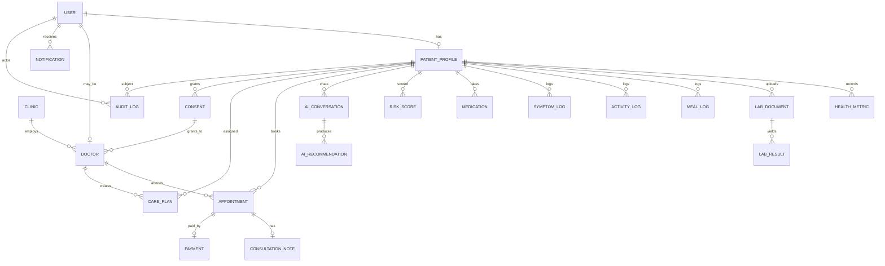
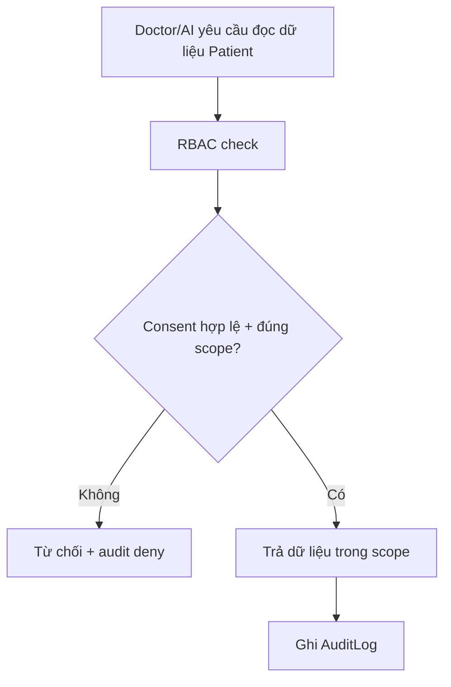

# Data Model Overview — MetoCare

> Thiết kế dữ liệu mức conceptual/logical: các entity lõi, quan hệ, phân loại dữ liệu, retention, xóa theo yêu cầu, truy cập gắn consent, auditability và định hướng tương thích FHIR. Chi tiết bảng vật lý sẽ do migration (Alembic) cụ thể hóa.

---

## 1. Purpose

Cung cấp mô hình dữ liệu thống nhất để Backend thiết kế schema, để Security phân loại và bảo vệ, và để AI/Analytics biết lấy dữ liệu ở đâu trong giới hạn consent. Đây là nguồn cho `Technical_Architecture.md` (data layer) và `Security_Compliance_Framework.md`.

## 2. Context

- DB chính PostgreSQL; `HealthMetric` ở TimescaleDB hypertable; file ở S3/MinIO (DB lưu key + metadata); embedding RAG ở pgvector/Qdrant.
- Dữ liệu sức khỏe = nhạy cảm. Mọi truy cập gắn Consent + Audit.
- Định hướng dài hạn tương thích HL7 FHIR (Việt Nam đẩy mạnh EMR/bệnh án điện tử), dù MVP chưa triển khai FHIR đầy đủ.

## 3. Decision / Scope

**Decision:** 21 core entity. `HealthMetric` lưu time-series (TimescaleDB). File nhị phân không lưu trong DB — chỉ lưu reference + classification. Mọi entity chứa dữ liệu sức khỏe gắn `data_classification` và truy cập qua Consent; mọi truy cập sinh AuditLog. Trường định danh/lâm sàng nhạy cảm áp field-level encryption.

**Out of scope:** schema vật lý chi tiết từng cột (để migration), FHIR mapping đầy đủ (định hướng ở mục 4.6).

### 3.1 Core Entities

| Entity | Mô tả | Classification |
|--------|-------|----------------|
| **User** | Tài khoản (mọi role). | Confidential |
| **PatientProfile** | Hồ sơ bệnh nhân: nhân khẩu, bệnh nền, dị ứng, tiền sử, lifestyle, risk_segment. | Sensitive health |
| **Doctor** | Hồ sơ bác sĩ: chuyên khoa, chứng chỉ, phòng khám. | Confidential |
| **Clinic** | Phòng khám/đối tác. | Internal |
| **HealthMetric** | Chỉ số theo thời gian (HA, đường huyết, HbA1c, lipid, men gan, cân nặng, vòng bụng...). | Sensitive health |
| **LabDocument** | File xét nghiệm gốc (ảnh/PDF) — reference S3 + metadata. | Sensitive health |
| **LabResult** | Kết quả trích từ OCR/đối tác (test_name, value, unit, reference_range, confidence, verified). | Sensitive health |
| **MealLog** | Bữa ăn: ảnh, lựa chọn nhanh, ước lượng rủi ro. | Sensitive health |
| **ActivityLog** | Vận động, giấc ngủ, thói quen. | Sensitive health |
| **SymptomLog** | Triệu chứng người dùng ghi nhận. | Sensitive health |
| **Medication** | Thuốc đang dùng (tên, liều ghi nhận — chỉ lưu, AI không đổi). | Sensitive health |
| **RiskScore** | Metabolic Score + mức rủi ro + top risks. | Sensitive health |
| **AIConversation** | Hội thoại AI: intent, messages, risk_level, escalated, model, safety_flags. | Sensitive health |
| **AIRecommendation** | Khuyến nghị/summary AI tạo. | Sensitive health |
| **Appointment** | Lịch hẹn online/offline. | Confidential |
| **ConsultationNote** | Ghi chú tư vấn của bác sĩ. | Sensitive health |
| **CarePlan** | Kế hoạch chăm sóc do bác sĩ tạo + adherence. | Sensitive health |
| **Consent** | Đồng ý: type, data_scope, granted_to, hiệu lực, thu hồi. | Confidential |
| **AuditLog** | Nhật ký truy cập/hành động (append-only). | Confidential |
| **Payment** | Giao dịch booking/subscription. | Confidential |
| **Notification** | Thông báo gửi tới user. | Internal |

### 3.2 Trường lõi tham khảo (từ đề án)

**PatientProfile:** patient_id, user_id, name, dob, gender, height, weight, waist, known_conditions, allergies, family_history, lifestyle_profile, risk_segment, created_at, updated_at.

**HealthMetric:** metric_id, patient_id, metric_type, value, unit, measured_at, source, device_id, normal_range_min, normal_range_max, status, created_at. `metric_type` ví dụ: blood_pressure_systolic, blood_pressure_diastolic, fasting_glucose, postprandial_glucose, hba1c, ldl, hdl, triglyceride, alt, ast, tsh, weight, waist.

**LabResult:** lab_result_id, patient_id, document_id, test_name, value, unit, reference_range, status, test_date, lab_name, ocr_confidence, verified_by_user, verified_by_doctor, created_at.

**AIConversation:** conversation_id, patient_id, intent, messages, risk_level, escalated_to_doctor, model_used, safety_flags, created_at.

**Consent:** consent_id, patient_id, consent_type, data_scope, granted_to, valid_from, valid_until, revoked_at, created_at.

**AuditLog:** audit_id, actor_type, actor_id, action, resource_type, resource_id, ip_address, device, timestamp.

## 4. Detailed Design / Requirements

### 4.1 Entity Relationship Overview

User là gốc; mỗi patient User có một PatientProfile. PatientProfile sở hữu các log sức khỏe (HealthMetric, LabResult, MealLog, ActivityLog, SymptomLog, Medication, RiskScore). LabResult thuộc một LabDocument. Doctor thuộc Clinic; Appointment nối Patient–Doctor; ConsultationNote và CarePlan gắn Appointment/Patient–Doctor. Consent điều phối truy cập của Doctor/Clinic vào dữ liệu Patient. AuditLog tham chiếu mọi resource. AIConversation/AIRecommendation gắn Patient. Payment gắn Appointment/Subscription. Notification gắn User.

### 4.2 Mermaid ERD

### 4.3 Data Classification

| Lớp | Định nghĩa | Ví dụ | Bảo vệ |
|-----|-----------|-------|--------|
| **Public** | Không nhạy cảm | Nội dung giáo dục công khai | Bình thường |
| **Internal** | Nội bộ vận hành | Clinic info, Notification | RBAC |
| **Confidential** | Định danh/giao dịch | User, Doctor, Payment, Consent, AuditLog | RBAC + mã hóa at-rest |
| **Sensitive health data** | Dữ liệu sức khỏe cá nhân | HealthMetric, LabResult, RiskScore, ConsultationNote, CarePlan, AIConversation | RBAC + Consent gate + field-level encryption + audit |

### 4.4 Data Retention & Deletion

- **Retention:** dữ liệu sức khỏe giữ theo mục đích chăm sóc và nghĩa vụ pháp lý; định nghĩa thời hạn theo loại (vd time-series cũ có thể nén/lưu trữ lạnh qua policy TimescaleDB). Audit log giữ lâu hơn theo yêu cầu tuân thủ.
- **Deletion request:** người dùng có quyền yêu cầu xóa. Quy trình: xác thực danh tính → đánh dấu xóa → xóa/ẩn danh dữ liệu cá nhân trong thời hạn cam kết, trừ phần phải lưu theo luật (ghi rõ lý do giữ). AuditLog ghi nhận hành động xóa nhưng không chứa lại nội dung nhạy cảm.
- **Ẩn danh cho phân tích/nghiên cứu:** chỉ dùng dữ liệu tổng hợp/ẩn danh và chỉ khi pháp lý chắc chắn + consent phù hợp.

### 4.5 Consent-linked Data Access & Auditability

- Mọi truy cập đọc dữ liệu Patient bởi Doctor/Clinic phải resolve tới một Consent còn hiệu lực với đúng `data_scope` và `granted_to`.
- Thu hồi consent (`revoked_at`) → chấm dứt quyền truy cập tương ứng ngay.
- Mọi truy cập/hành động (gồm AI đọc dữ liệu, xuất báo cáo) sinh một AuditLog append-only (actor, action, resource, time, ip/device).

### 4.6 Future FHIR Compatibility

Thiết kế entity bám khái niệm dễ map sang FHIR về sau: PatientProfile↔Patient, HealthMetric/LabResult↔Observation, Medication↔MedicationStatement, Appointment↔Appointment, ConsultationNote↔Encounter/DocumentReference, CarePlan↔CarePlan, Doctor↔Practitioner, Clinic↔Organization, Consent↔Consent. MVP chưa triển khai FHIR; Phase 2 export PDF/CSV + FHIR-lite; Phase 3 FHIR đầy đủ khi tích hợp bệnh viện lớn. Giữ id ổn định, code hệ thống tách biệt để map mã (LOINC/SNOMED) sau.

## 5. Risks

| Rủi ro | Giảm thiểu |
|--------|-----------|
| Truy cập vượt phạm vi consent | Consent gate bắt buộc + audit deny; test. |
| Time-series phình to | Hypertable + compression + retention policy. |
| Xóa dữ liệu nhưng còn ở backup/log | Quy trình xử lý backup theo retention; audit không chứa nội dung nhạy cảm. |
| Khó map FHIR về sau | Giữ entity bám khái niệm FHIR + id ổn định + code system tách. |
| OCR result sai làm bẩn dữ liệu | `ocr_confidence` + verified_by_user/doctor trước khi dùng kết luận. |

## 6. Acceptance Criteria

- [ ] 21 entity có định nghĩa + classification.
- [ ] HealthMetric thiết kế time-series (hypertable).
- [ ] Mọi entity sensitive health gắn Consent gate + audit khi truy cập.
- [ ] Field nhạy cảm có field-level encryption.
- [ ] Có quy trình deletion request + retention policy theo loại.
- [ ] Mapping FHIR định hướng được ghi nhận cho Phase 2–3.

## 7. Next Steps

1. Chuyển thành schema vật lý + migration Alembic đầu tiên (User, PatientProfile, HealthMetric, Consent, AuditLog).
2. Triển khai hypertable + continuous aggregate cho HealthMetric.
3. Cài middleware Consent + Audit theo sơ đồ 4.5.
4. Lập bảng retention theo loại dữ liệu + quy trình xóa.
