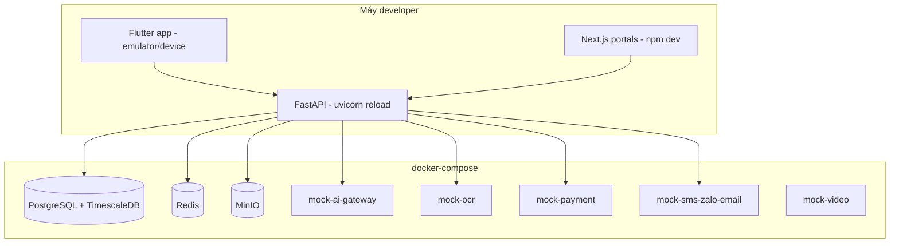
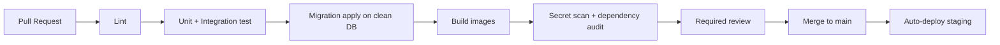

# DevEnv Hardening Plan — MetoCare

> Thiết kế môi trường phát triển an toàn, ổn định, bàn giao được cho team dev. Mục tiêu kép: dev chạy được hệ thống đầy đủ trên máy local trong < 1 giờ, và **không một byte dữ liệu y tế thật nào** lọt vào môi trường dev.

---

## 1. Purpose

Chuẩn hóa cách dev dựng, chạy, test và bảo vệ môi trường phát triển MCP. Vì đây là hệ thống xử lý dữ liệu sức khỏe nhạy cảm, môi trường dev phải vừa thuận tiện vừa được "hardened" để rủi ro bảo mật không bắt đầu từ chính laptop của developer.

## 2. Context

- Backend: FastAPI (modular monolith). DB: PostgreSQL + TimescaleDB. Redis, MinIO (thay S3 local), pgvector.
- Mobile: Flutter. Web: Next.js.
- Nhiều dịch vụ ngoài (AI provider, OCR, payment, SMS/Zalo/Email, video) → **không** gọi thật khi dev, phải mock.
- Nhiều người chạm code → cần kỷ luật git, secrets, migration, review.

## 3. Decision / Scope

**Decision:**

1. Toàn bộ stack hạ tầng local chạy bằng **một** `docker-compose.yml` duy nhất (Postgres+Timescale, Redis, MinIO, mock services).
2. Mọi external service được thay bằng **mock container** mặc định; gọi provider thật chỉ bật có chủ đích qua biến môi trường ở môi trường staging.
3. **Cấm tuyệt đối**: hardcode API key, commit `.env`, đưa dữ liệu y tế thật vào dev. Vi phạm = block merge.
4. Dữ liệu dev sinh bằng **fake data generator** (bệnh nhân, xét nghiệm, chỉ số) — synthetic, không có người thật.
5. Mọi PR phải qua **lint + test + build gate** và **review** trước khi merge.

**Scope:** local dev environment, CI baseline, secrets, migration, seed, mock, onboarding, security hardening.
**Out of scope:** thiết kế hạ tầng production (xem `Technical_Architecture.md` mục Deployment), pentest production.

## 4. Detailed Design / Requirements

### 4.1 Local development setup

Yêu cầu: `make up` dựng toàn bộ compose; `make migrate` chạy migration; `make seed` nạp fake data; `make test`; `make down`. Tài liệu README chỉ rõ version Docker, Flutter SDK, Node, Python.

### 4.2 Docker Compose architecture

- Một file `docker-compose.yml` + `docker-compose.override.yml` cho tùy biến cá nhân (không commit override cá nhân nhạy cảm).
- Mỗi service pin version cụ thể (không `latest`).
- Postgres image có sẵn TimescaleDB; init script tạo extension `timescaledb`, `pgvector`, schema cơ bản.
- Healthcheck cho mọi service; backend chờ DB healthy mới start.

### 4.3 Environment variables strategy

- `.env.example` được commit (chỉ chứa **tên biến** + giá trị giả/placeholder).
- `.env` thật **không bao giờ** commit (đã có trong `.gitignore`).
- Phân tầng: `.env.local` (dev), config staging/prod nằm ở secret manager, không trong repo.
- Backend đọc config qua một `Settings` (pydantic) — fail-fast nếu thiếu biến bắt buộc.

### 4.4 Secrets management

- Local: secrets trong `.env.local` (gitignored), không chia sẻ qua chat/email; chia sẻ qua secret manager nội bộ (vd 1Password/Vault).
- Staging/Prod: dùng secret manager (HashiCorp Vault hoặc cloud secret manager), inject lúc runtime, không nằm trong image.
- **Cấm**: key trong source, trong Dockerfile, trong CI log, trong client app (Flutter/Next.js không chứa secret backend).
- Có quy trình rotate key; key lộ → rotate ngay + ghi sự cố.

### 4.5 Database migration discipline

- Công cụ: **Alembic** (FastAPI/SQLAlchemy).
- Mỗi thay đổi schema = một migration có review; **không** sửa migration đã merge.
- Migration phải reversible (`upgrade`/`downgrade`) hoặc ghi rõ lý do irreversible.
- Cấm sửa schema thủ công trên DB; mọi thay đổi qua migration.
- CI chạy migration trên DB sạch để đảm bảo apply được từ đầu.

### 4.6 Seed data policy

- Seed **chỉ** dùng fake data generator (mục 4.16). Không có PII/PHI thật.
- Seed phân loại: `seed:minimal` (chạy test), `seed:demo` (demo nội bộ, nhiều bệnh nhân synthetic).
- Tài khoản demo có role rõ (patient/doctor/clinic_admin/internal_admin) với mật khẩu rõ là "demo-only", không tái dùng ở môi trường khác.

### 4.7 Branching strategy

- **Trunk-based với short-lived feature branches**.
- `main`: luôn deployable. Nhánh `feat/*`, `fix/*`, `chore/*` xuất phát từ `main`, sống ngắn (< vài ngày), merge qua PR.
- Release qua tag (`v0.x`), hotfix qua `hotfix/*`.

### 4.8 Commit convention

- **Conventional Commits**: `feat:`, `fix:`, `chore:`, `docs:`, `refactor:`, `test:`, `perf:`, `security:`.
- Commit message tham chiếu issue/task ID.
- Enforce bằng commit-msg hook (commitlint).

### 4.9 CI/CD baseline

- CI bắt buộc xanh mới merge. Deploy production là thủ công có phê duyệt (Phase sau).

### 4.10 Lint/test/build gate

- Backend: `ruff`/`flake8` + `black` + `mypy` (typed), `pytest` coverage tối thiểu (vd ≥ 70% module lõi).
- Frontend web: `eslint` + `prettier` + `tsc` + test.
- Mobile: `dart analyze` + `flutter test`.
- Build phải pass; gate fail → block merge.

### 4.11 Pre-commit hooks

- `pre-commit` framework: format, lint, **secret scan (gitleaks/detect-secrets)**, check `.env` không bị add, block file lớn, commitlint.
- Hook secret-scan là bắt buộc, không bypass tùy tiện.

### 4.12 Backup/restore local database

- Script `make db-dump` / `make db-restore` (pg_dump/pg_restore) cho snapshot local.
- Snapshot local chỉ chứa fake data; dù vậy vẫn không commit dump vào repo.

### 4.13 Log management (dev)

- Log có cấu trúc (JSON) qua một logger chung; level cấu hình qua env.
- Dev xem log qua `docker compose logs` / console; không gửi log dev ra ngoài.
- **Cấm log PHI/PII và secrets**: logger có filter loại bỏ field nhạy cảm (token, số đo gắn danh tính ở mức raw...).

### 4.14 Audit log development mode

- Audit log là tính năng sản phẩm, không tắt được ở mọi môi trường.
- Ở dev: audit ghi vào bảng `audit_log` như prod nhưng trên fake data; dev có endpoint/CLI để xem audit để test đúng hành vi.
- Test bắt buộc: mỗi truy cập dữ liệu bệnh nhân sinh đúng 1 audit record.

### 4.15 Mock external services (mặc định khi dev)

| Dịch vụ | Mock behavior |
|---------|---------------|
| **AI provider** | `mock-ai-gateway` trả response cố định/giả lập theo intent; có chế độ giả lập "red flag" để test escalation; không gọi LLM thật. |
| **OCR** | `mock-ocr` nhận file, trả kết quả OCR mẫu (lab result giả) với `ocr_confidence` cấu hình được. |
| **Payment** | `mock-payment` giả lập success/fail/pending; không kết nối cổng thật. |
| **SMS/Zalo/Email** | `mock-sms-zalo-email` ghi message ra log/inbox giả, không gửi thật. |
| **Video consultation** | `mock-video` trả room URL giả; không tạo phòng thật. |

Bật provider thật: chỉ ở staging, qua biến `*_PROVIDER=real` + secrets từ secret manager, có người duyệt.

### 4.16 Fake data generator

- Module CLI (`scripts/generate_fake_data.py`) dùng Faker + sinh dữ liệu y tế hợp lý:
  - Bệnh nhân synthetic (tên, DOB, giới, chiều cao/cân nặng/vòng bụng).
  - Chỉ số sức khỏe theo thời gian (huyết áp, đường huyết, HbA1c, lipid, men gan...) trong khoảng tham chiếu hợp lý, có cả case bất thường để test cảnh báo/triage.
  - Lab document (PDF/ảnh giả) + lab result.
  - Meal/activity/symptom log.
- Có "scenario": tiền tiểu đường, gan nhiễm mỡ, mỡ máu, tăng huyết áp, có cả case red flag.
- **Tuyệt đối không** seed bằng dữ liệu trích từ bệnh nhân thật.

### 4.17 Developer onboarding checklist

- [ ] Cài Docker, Flutter SDK, Node, Python theo version trong README.
- [ ] Clone repo, copy `.env.example` → `.env.local`, lấy secret dev qua secret manager (không qua chat).
- [ ] `make up && make migrate && make seed:demo`.
- [ ] Cài `pre-commit install` (bắt buộc).
- [ ] Chạy `make test` xanh.
- [ ] Đọc và ký xác nhận `Architecture_Doctrine.md`, `AI_Safety_Guardrail.md`, `Security_Compliance_Framework.md`.
- [ ] Hiểu quy tắc: không dữ liệu thật ở dev, không commit secret.

### 4.18 Security hardening checklist (dev)

- [ ] `.gitignore` chặn `.env*`, dump DB, file credential, build artifact.
- [ ] Pre-commit secret-scan bật và không bị bypass.
- [ ] Dependency audit (pip-audit / npm audit / dart pub) chạy trong CI.
- [ ] Container không chạy root khi không cần; port nhạy cảm chỉ bind localhost.
- [ ] Không có endpoint debug mở ngoài localhost.
- [ ] Log filter loại bỏ PHI/secret đã bật.
- [ ] Tài khoản demo không trùng credential môi trường khác.

### 4.19 Quy trình review trước khi merge

- Mỗi PR: ít nhất 1 reviewer (PR chạm dữ liệu sức khỏe/AI/security: 2 reviewer, trong đó 1 là Tech Lead hoặc Security owner).
- Checklist review: gate xanh; có migration đúng; có test; không secret/PHI; không vi phạm doctrine; consent/audit còn nguyên cho mọi truy cập dữ liệu bệnh nhân.
- AI/triage/guardrail change: cần thêm review từ AI owner và (nếu chạm nội dung y tế) Medical Reviewer.

## 5. Risks

| Rủi ro | Giảm thiểu |
|--------|-----------|
| Dev vô tình dùng dữ liệu thật để test | Chính sách cấm + fake data generator + review; không cấp quyền truy cập prod data cho dev. |
| Secret lọt vào git history | Pre-commit secret-scan + CI secret-scan + rotate ngay khi lộ. |
| Migration xung đột/không apply được | CI apply migration trên DB sạch; cấm sửa migration đã merge. |
| Mock khác hành vi thật → bug ở staging | Mock bám contract; có bộ test contract chạy với provider thật ở staging. |
| Onboarding chậm/không nhất quán | Checklist + `make` targets + README chuẩn. |

## 6. Acceptance Criteria

- [ ] `make up && make migrate && make seed:demo` cho hệ thống chạy đầy đủ với mock < 1 giờ trên máy mới.
- [ ] Không có secret/`.env`/PHI nào trong repo (CI secret-scan xanh).
- [ ] Pre-commit hooks cài đặt được và chặn được secret demo.
- [ ] CI gate (lint/test/migrate/build/secret-scan) bắt buộc xanh trước merge.
- [ ] Fake data generator sinh ≥ 4 scenario bệnh chuyển hóa gồm case red flag.
- [ ] Mọi external service có mock chạy mặc định; không cần key thật để dev.

## 7. Next Steps

1. Tạo `docker-compose.yml`, `Makefile`, `.env.example`, `.gitignore`, cấu hình `pre-commit`.
2. Viết 5 mock service container.
3. Viết fake data generator + scenario.
4. Dựng CI pipeline (lint/test/migrate/build/secret-scan).
5. Viết README onboarding + chạy thử với 1 dev mới để đo thời gian.
