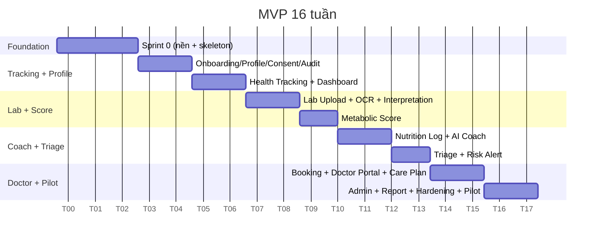
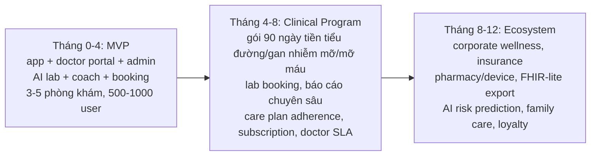

# MVP Scope & Roadmap — Metabolic Care Platform

> Chốt MVP (làm gì, không làm gì) và lộ trình phát triển: 16 tuần MVP + 12 tháng, các pha phát hành, tiêu chí pilot, go/no-go và rủi ro. Nguyên tắc: **MVP không tham** — làm sâu một vòng giá trị cho một nhóm bệnh.

---

## 1. Purpose

Định nghĩa rõ phạm vi MVP theo P0/P1/P2, lộ trình 16 tuần và 12 tháng, các pha, tiêu chí thành công pilot và điều kiện go/no-go. Đây là tài liệu chốt scope để team không phình MVP.

## 2. Context

- Khoảng trống thị trường: app đặt lịch chỉ "book bác sĩ", không tạo dữ liệu trước khám và không hỗ trợ tuân thủ sau khám.
- Rủi ro lớn nhất **không** phải kỹ thuật mà là: người dùng không nhập dữ liệu đều, bác sĩ không dùng portal, AI trả lời quá đà, phòng khám không phản hồi SLA, pháp lý dữ liệu, unit economics phụ thuộc commission.
- MVP đề xuất 16 tuần; làm sâu nhóm tiền tiểu đường / rối loạn chuyển hóa / béo bụng / mỡ máu.

## 3. Decision / Scope

### 3.1 MVP Product Thesis

> "Một app theo dõi sức khỏe chuyển hóa biết đọc xét nghiệm của bạn, chấm điểm rủi ro dễ hiểu, coaching lối sống tiếng Việt mỗi ngày, và nối bạn với bác sĩ kèm dữ liệu chuẩn bị sẵn — AI làm lớp chăm sóc liên tục giữa các lần khám, không thay bác sĩ."

Chứng minh: người dùng dùng hằng tuần **và** bác sĩ thấy hữu ích.

### 3.2 MVP Target Users

Người tiền tiểu đường / tiểu đường type 2 giai đoạn đầu, người béo bụng/rối loạn mỡ máu, người tăng huyết áp, người gan nhiễm mỡ. Phía cung: 3–5 phòng khám/bác sĩ đối tác (nội tiết/tim mạch/dinh dưỡng/gan mật).

### 3.3 MVP Use Cases

1. Onboarding + nhập hồ sơ + consent.
2. Nhập/theo dõi chỉ số + dashboard + cảnh báo bất thường.
3. Upload xét nghiệm → OCR → AI giải thích.
4. Xem Metabolic Score + top risks + suggested actions.
5. Ghi bữa ăn đơn giản + nhận coaching lối sống.
6. Triage khi có triệu chứng → phân tầng + escalate khi cần.
7. Đặt lịch bác sĩ + gửi hồ sơ trước khám.
8. Bác sĩ xem summary + ghi tư vấn + care plan đơn giản + chat follow-up.
9. Admin quản lý user/bác sĩ/phòng khám/booking + AI logs + audit.

### 3.4 P0 Features (bắt buộc MVP)

Đăng ký/đăng nhập + consent + audit; hồ sơ sức khỏe; nhập tay chỉ số + dashboard + biểu đồ xu hướng + cảnh báo; upload xét nghiệm + OCR + AI lab interpretation + verify; Metabolic Score bản đầu; ghi bữa ăn đơn giản + AI lifestyle coach; triage (red flag rule engine + risk classifier + escalation); đặt lịch bác sĩ + gửi hồ sơ trước + thanh toán booking; doctor portal (summary, chỉ số/xét nghiệm, ghi tư vấn, care plan đơn giản, chat); admin portal cơ bản + AI logs + audit; notification (nhắc/cảnh báo); xuất báo cáo PDF cho bác sĩ.

### 3.5 P1 Features (ngay sau MVP — Phase 2/3)

Quản lý thuốc; sync Apple/Google Health; AI nhận diện món Việt; vận động/giấc ngủ/thói quen; thử thách 7/30/90 ngày; weekly health report; video consult; đề xuất xét nghiệm + adherence report; subscription gói; care program 90 ngày (tiền tiểu đường, gan nhiễm mỡ, mỡ máu/huyết áp); lab booking; clinic gói/doanh thu/SLA; đánh giá dịch vụ.

### 3.6 P2 Features (sau — Phase 3+)

Sync thiết bị (cân/HA/glucometer); family care; corporate wellness; insurance partnership; pharmacy/device integration; FHIR-lite export; AI risk prediction; loyalty/engagement engine; Metabolic Executive Health concierge.

### 3.7 What NOT to Build in MVP

Kết nối quá nhiều thiết bị; marketplace bác sĩ quá rộng; AI diagnosis nâng cao; bán thuốc; tích hợp sâu HIS/EMR; insurance claim; corporate wellness phức tạp; microservices; care program đầy đủ; FHIR đầy đủ.

## 4. Detailed Design / Requirements

### 4.1 16-Week MVP Roadmap

Tuần 1–3: Sprint 0. Tuần 4–7: Profile + Tracking. Tuần 8–11: Lab OCR + AI interpretation + Metabolic Score. Tuần 12–14: Nutrition coach + Triage. Tuần 15–16: Booking + Doctor Portal + Admin + report + hardening + chuẩn bị pilot.

### 4.2 Release Phases

| Phase | Tên | Nội dung chính |
|-------|-----|----------------|
| **Phase 0** | Sprint 0 / Foundation | Repo, CI, dev env, walking skeleton, schema + contract, khung guardrail, backlog. |
| **Phase 1** | Tracking + Profile + Lab Upload | Onboarding, hồ sơ, nhập chỉ số, dashboard, cảnh báo, upload xét nghiệm + OCR, consent/audit. |
| **Phase 2** | AI Interpretation + Metabolic Score | AI lab interpretation, Metabolic Score, RAG duyệt, AI assistant. |
| **Phase 3** | Nutrition Coach + Habit | Ghi bữa ăn, AI lifestyle coach, vận động/giấc ngủ, thử thách. |
| **Phase 4** | Doctor Booking + Doctor Portal | Tìm/đặt lịch, gửi hồ sơ trước, doctor portal, summary, note, chat, payment, clinic/admin. |
| **Phase 5** | Care Plan + Follow-up | Care plan, AI nhắc thực hiện, adherence, đề xuất xét nghiệm, subscription. |
| **Phase 6** | Pilot Launch | 3–5 phòng khám, 500–1.000 user đầu, đo KPI, go/no-go scale. |

### 4.3 12-Month Roadmap

- **Giai đoạn 1 (0–4 tháng):** chứng minh dùng hằng tuần + bác sĩ thấy hữu ích.
- **Giai đoạn 2 (4–8 tháng):** biến app thành chương trình chăm sóc có kết quả đo được.
- **Giai đoạn 3 (8–12 tháng):** mở rộng B2B/B2B2C.

### 4.4 Pilot Success Metrics

- **User:** ≥ X% nhập dữ liệu hằng tuần; retention tuần 4 ≥ ngưỡng; hoàn thành onboarding cao; số lần mở app/tuần.
- **Clinical:** cải thiện đo được ở nhóm tham gia (cân nặng/vòng bụng giảm, HbA1c/huyết áp/triglyceride/LDL cải thiện) sau chu kỳ; tỷ lệ tuân thủ care plan.
- **Doctor:** bác sĩ dùng portal; thời gian tiết kiệm/ca; NPS bác sĩ tích cực.
- **Business:** conversion onboarding→booking; số booking; ARPU bước đầu; SLA phòng khám đạt.
- **Safety:** false negative red flag = 0; không sự cố AI vượt ranh giới; 100% truy cập dữ liệu có consent + audit.

### 4.5 Go/No-Go Criteria (sau pilot)

**Go nếu:** người dùng dùng hằng tuần đạt ngưỡng; bác sĩ tiếp tục dùng portal; có tín hiệu cải thiện lâm sàng; không sự cố an toàn AI/dữ liệu nghiêm trọng; unit economics có đường về dương (không phụ thuộc duy nhất commission booking); phòng khám đạt SLA.

**No-Go/điều chỉnh nếu:** retention thấp; bác sĩ bỏ portal; AI vượt ranh giới; sự cố dữ liệu; SLA phòng khám kém; chi phí tư vấn bác sĩ làm economics âm.

## 5. Risks

| Loại | Rủi ro | Giảm thiểu |
|------|--------|-----------|
| **Technical** | OCR/AI latency hoặc sai; time-series scale | Mock+test, confidence+verify, hypertable, async, fallback. |
| **Technical** | Modular monolith coupling | Ranh giới module + review. |
| **Product** | Người dùng không nhập dữ liệu | Chụp ảnh/sync, nhắc thông minh, gamification nhẹ, weekly report, family reminder. |
| **Product** | Bác sĩ không dùng portal | Summary 1 trang, ít nhập, template, incentive, assistant ghi chú. |
| **Medical/Legal** | AI vượt ranh giới / pháp lý dữ liệu | Guardrail cứng, red flag engine, nội dung duyệt, consent/audit, tư vấn pháp lý sớm, DPA. |
| **Business** | Unit economics xấu | AI xử lý tầng thấp, gói 90 ngày, B2B, không sống chỉ bằng commission booking. |
| **Business** | Phòng khám không đạt SLA | SLA rõ + theo dõi + incentive + dự phòng nhiều đối tác. |

## 6. Acceptance Criteria

- [ ] Bộ P0 chốt và đủ để chạy vòng giá trị MVP.
- [ ] Roadmap 16 tuần + 12 tháng có pha rõ và nhất quán với `Product_Module_Map.md`.
- [ ] Pilot metrics có định nghĩa đo được + nguồn dữ liệu.
- [ ] Go/no-go criteria được Founder/CTO/Medical lead thống nhất.
- [ ] "What not to build" được tôn trọng trong backlog (không lén thêm scope).

## 7. Next Steps

1. Chốt ngưỡng số cụ thể cho pilot metrics (X%, retention target, ARPU target) cùng Founder.
2. Ký 3–5 phòng khám đối tác cho pilot.
3. Lập backlog P0 chi tiết từ `Product_Module_Map.md` + `BRD.md`.
4. Khởi động Sprint 0 (`Sprint0_Execution_Blueprint.md`).
5. Chuẩn bị khung đo lường KPI + dashboard pilot.
