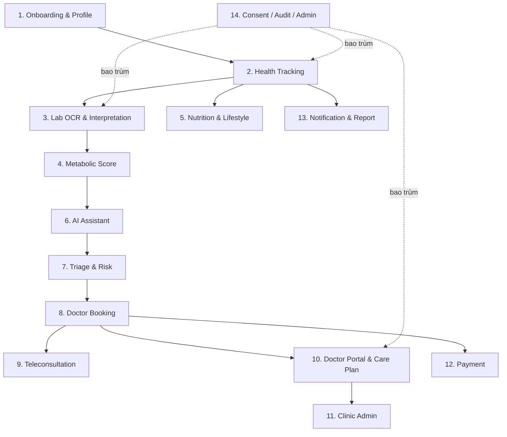

# Product Module Map — Metabolic Care Platform

> Bản đồ toàn bộ module/submodule sản phẩm: giá trị người dùng, giá trị kinh doanh, dữ liệu cần, phụ thuộc, ưu tiên MVP (P0/P1/P2), độ phức tạp, mức rủi ro, owner và pha phát hành. Đây là nguồn để cắt scope và lập backlog.

---

## 1. Purpose

Cung cấp cái nhìn một-trang về tất cả module sản phẩm và độ ưu tiên, để Product/Tech quyết định cái gì làm trước, cái gì hoãn, ai chịu trách nhiệm.

## 2. Context

- Ưu tiên MVP: Health Tracking + Lab AI Interpretation + Lifestyle Coach + Doctor Booking + Doctor Portal.
- Ký hiệu: **P0** = bắt buộc MVP; **P1** = ngay sau MVP (Phase 2); **P2** = sau (Phase 3+).
- Complexity: Low / Medium / High. Risk: Low / Med / High (gồm rủi ro y tế/pháp lý).
- Owner role: BE (Backend), MOB (Mobile), WEB (Web Portal), AI (AI/ML), PROD (Product/BA), SEC (Security/Compliance), MED (Medical Governance), OPS (DevOps).

## 3. Decision / Scope

**Decision:** 14 module lớn. MVP gồm các submodule P0 đủ để chạy vòng giá trị: tracking → lab AI → score → coach → triage → booking → doctor portal, có consent/audit. Mọi module chạm dữ liệu bệnh nhân đều gắn Consent + Audit (cross-cutting, P0).

### 3.1 Bản đồ tổng quan

## 4. Detailed Design / Requirements

### Module 1 — Onboarding & Profile
| Submodule | User value | Business value | Data | Dependency | MVP | Complexity | Risk | Owner | Phase |
|-----------|-----------|----------------|------|-----------|-----|-----------|------|-------|-------|
| Đăng ký/đăng nhập | Vào app an toàn | Tài khoản nền tảng | User, Session | Auth | P0 | Low | Med | BE | 1 |
| Consent onboarding | Hiểu & kiểm soát dữ liệu | Tuân thủ pháp lý | Consent | Consent | P0 | Med | High | SEC | 1 |
| Hồ sơ sức khỏe | Cá nhân hóa | Dữ liệu nền | PatientProfile | — | P0 | Low | Med | MOB | 1 |
| Family profile | Theo dõi người thân | Giữ chân/mở rộng | PatientProfile | Consent | P2 | Med | Med | PROD | 3 |

### Module 2 — Health Tracking
| Submodule | User value | Business value | Data | Dependency | MVP | Complexity | Risk | Owner | Phase |
|-----------|-----------|----------------|------|-----------|-----|-----------|------|-------|-------|
| Nhập tay chỉ số | Theo dõi dễ | Lõi dữ liệu | HealthMetric | — | P0 | Low | Low | MOB | 1 |
| Dashboard + biểu đồ xu hướng | Hiểu tiến triển | Giữ chân | HealthMetric | TimescaleDB | P0 | Med | Low | MOB | 1 |
| Cảnh báo chỉ số bất thường | An tâm/an toàn | Niềm tin | HealthMetric | Triage | P0 | Med | Med | BE | 1 |
| Quản lý thuốc | Nhắc dùng thuốc | Tuân thủ | Medication | — | P1 | Med | Med | BE | 2 |
| Sync Apple/Google Health | Ít nhập tay | Giữ chân | HealthMetric | Integration | P1 | High | Med | MOB | 2 |
| Sync thiết bị (cân/HA/glucometer) | Tự động hóa | Khác biệt | HealthMetric | Integration | P2 | High | Med | BE | 3 |

### Module 3 — Lab OCR & Interpretation
| Submodule | User value | Business value | Data | Dependency | MVP | Complexity | Risk | Owner | Phase |
|-----------|-----------|----------------|------|-----------|-----|-----------|------|-------|-------|
| Upload ảnh/PDF xét nghiệm | Số hóa kết quả | Lõi dữ liệu | LabDocument | S3/MinIO | P0 | Med | Med | BE | 1 |
| OCR trích kết quả | Đỡ nhập tay | Hiệu quả | LabResult | OCR provider | P0 | High | High | AI | 1 |
| AI lab interpretation | Hiểu kết quả | Khác biệt cốt lõi | LabResult, RAG | AI Gateway, Guardrail | P0 | High | High | AI | 2 |
| Verify kết quả (user/bác sĩ) | Chính xác | An toàn | LabResult | — | P0 | Low | Med | BE | 2 |

### Module 4 — Metabolic Score
| Submodule | User value | Business value | Data | Dependency | MVP | Complexity | Risk | Owner | Phase |
|-----------|-----------|----------------|------|-----------|-----|-----------|------|-------|-------|
| Tính điểm 0–100 + mức rủi ro | Hiểu tổng quan | Sản phẩm chiến lược | RiskScore, HealthMetric, LabResult | MED duyệt công thức | P0 | Med | High | AI+MED | 2 |
| Top risks + suggested actions | Biết làm gì | Engagement | RiskScore | — | P0 | Med | Med | AI | 2 |

### Module 5 — Nutrition & Lifestyle
| Submodule | User value | Business value | Data | Dependency | MVP | Complexity | Risk | Owner | Phase |
|-----------|-----------|----------------|------|-----------|-----|-----------|------|-------|-------|
| Ghi bữa ăn (ảnh + chọn nhanh) | Low-friction | Giữ chân | MealLog | S3 | P0 | Med | Low | MOB | 3 |
| AI nhận diện món Việt | Tiện | Khác biệt | MealLog | AI | P1 | High | Med | AI | 3 |
| AI nutrition/lifestyle coach | Thay đổi hành vi | Khác biệt cốt lõi | MealLog, ActivityLog | AI Gateway, Guardrail | P0 | High | Med | AI | 3 |
| Vận động/giấc ngủ/thói quen | Toàn diện | Engagement | ActivityLog | — | P1 | Med | Low | MOB | 3 |
| Thử thách 7/30/90 ngày | Động lực | Giữ chân | ActivityLog | Notification | P1 | Med | Low | PROD | 3 |

### Module 6 — AI Assistant
| Submodule | User value | Business value | Data | Dependency | MVP | Complexity | Risk | Owner | Phase |
|-----------|-----------|----------------|------|-----------|-----|-----------|------|-------|-------|
| LLM Gateway + guardrail | An toàn AI | Bắt buộc | AIConversation | Guardrail | P0 | High | High | AI+MED | 2 |
| Health assistant chat | Giải đáp | Engagement | AIConversation | RAG | P0 | High | High | AI | 2 |
| Doctor summary generator | Chuẩn bị khám | Doctor handoff | AIRecommendation | RAG | P0 | High | Med | AI | 4 |
| Medical RAG | Tri thức đúng | An toàn nội dung | RAG corpus | MED duyệt | P0 | High | High | AI+MED | 2 |

### Module 7 — Triage & Risk
| Submodule | User value | Business value | Data | Dependency | MVP | Complexity | Risk | Owner | Phase |
|-----------|-----------|----------------|------|-----------|-----|-----------|------|-------|-------|
| Rule-based red flag engine | An toàn | Niềm tin/pháp lý | TriageEvent | MED red flag list | P0 | Med | High | AI+MED | 2 |
| Risk classifier 4 mức | Phân tầng | Định tuyến chăm sóc | RiskScore | LLM | P0 | High | High | AI | 2 |
| Escalation engine | Cứu nguy kịp thời | An toàn | TriageEvent | Booking/Notification | P0 | Med | High | BE+MED | 2 |

### Module 8 — Doctor Booking
| Submodule | User value | Business value | Data | Dependency | MVP | Complexity | Risk | Owner | Phase |
|-----------|-----------|----------------|------|-----------|-----|-----------|------|-------|-------|
| Tìm bác sĩ/phòng khám | Tiếp cận | Doanh thu | Doctor, Clinic | — | P0 | Med | Low | WEB+MOB | 4 |
| Đặt lịch online/offline | Tiện | Commission | Appointment | Payment | P0 | Med | Med | BE | 4 |
| Gửi hồ sơ trước khám | Khám hiệu quả | Khác biệt | Consent, summary | Consent | P0 | Med | Med | BE | 4 |
| Đánh giá dịch vụ | Tin tưởng | Chất lượng | — | — | P1 | Low | Low | PROD | 4 |

### Module 9 — Teleconsultation
| Submodule | User value | Business value | Data | Dependency | MVP | Complexity | Risk | Owner | Phase |
|-----------|-----------|----------------|------|-----------|-----|-----------|------|-------|-------|
| Chat với bác sĩ | Hỏi đáp | Engagement | ConsultationNote | — | P0 | Med | Med | BE | 4 |
| Video consult | Khám từ xa | Doanh thu | Appointment | Video provider | P1 | High | Med | BE | 4 |

### Module 10 — Doctor Portal & Care Plan
| Submodule | User value (bác sĩ) | Business value | Data | Dependency | MVP | Complexity | Risk | Owner | Phase |
|-----------|---------------------|----------------|------|-----------|-----|-----------|------|-------|-------|
| Xem hồ sơ đã consent + biểu đồ | Dữ liệu trước khám | Doctor handoff | PatientProfile, HealthMetric, LabResult | Consent | P0 | Med | High | WEB | 4 |
| Xem AI summary | Tiết kiệm thời gian | Khác biệt | AIRecommendation | AI | P0 | Med | Med | WEB | 4 |
| Ghi consultation note | Lưu tư vấn | Hồ sơ | ConsultationNote | — | P0 | Low | Med | WEB | 4 |
| Tạo care plan đơn giản | Hướng dẫn bệnh nhân | Chương trình | CarePlan | — | P0 | Med | Med | WEB | 5 |
| Đề xuất xét nghiệm | Theo dõi | Lab commission | CarePlan | — | P1 | Low | Med | WEB | 5 |
| Adherence report | Theo dõi sau khám | Kết quả đo được | CarePlan, HealthMetric | — | P1 | Med | Med | WEB | 5 |

### Module 11 — Clinic Admin
| Submodule | User value | Business value | Data | Dependency | MVP | Complexity | Risk | Owner | Phase |
|-----------|-----------|----------------|------|-----------|-----|-----------|------|-------|-------|
| Quản lý bác sĩ/lịch | Vận hành | B2B | Clinic, ClinicStaff | — | P0 | Med | Low | WEB | 4 |
| Quản lý booking/bệnh nhân | Vận hành | Doanh thu | Appointment | — | P0 | Med | Low | WEB | 4 |
| Quản lý gói chăm sóc/doanh thu/SLA | Kinh doanh | B2B | CarePlan, Payment | — | P1 | Med | Med | WEB | 5 |

### Module 12 — Payment
| Submodule | User value | Business value | Data | Dependency | MVP | Complexity | Risk | Owner | Phase |
|-----------|-----------|----------------|------|-----------|-----|-----------|------|-------|-------|
| Thanh toán booking | Tiện | Doanh thu | Payment | Payment gateway | P0 | Med | Med | BE | 4 |
| Subscription gói | Doanh thu định kỳ | ARPU | Payment | Gateway | P1 | Med | Med | BE | 5 |

### Module 13 — Notification & Report
| Submodule | User value | Business value | Data | Dependency | MVP | Complexity | Risk | Owner | Phase |
|-----------|-----------|----------------|------|-----------|-----|-----------|------|-------|-------|
| Nhắc đo/lịch hẹn/cảnh báo | Đúng việc mỗi ngày | Giữ chân | Notification | SMS/Zalo/Email | P0 | Med | Low | BE | 1 |
| Weekly health report | Tổng kết | Engagement | HealthMetric | — | P1 | Med | Low | BE | 2 |
| Xuất báo cáo PDF cho bác sĩ | Chia sẻ khám | Doctor handoff | HealthMetric, LabResult | — | P0 | Med | Med | BE | 1 |

### Module 14 — Consent / Audit / Admin (cross-cutting)
| Submodule | User value | Business value | Data | Dependency | MVP | Complexity | Risk | Owner | Phase |
|-----------|-----------|----------------|------|-----------|-----|-----------|------|-------|-------|
| Consent management | Kiểm soát dữ liệu | Pháp lý | Consent | — | P0 | Med | High | SEC | 1 |
| Audit log | Minh bạch | Pháp lý/an toàn | AuditLog | — | P0 | Med | High | SEC | 1 |
| Admin dashboard + AI logs | Vận hành | Vận hành/an toàn | Aggregations, AIConversation | — | P0 | Med | Med | WEB+OPS | 4 |

## 5. Risks

| Rủi ro | Module liên quan | Giảm thiểu |
|--------|------------------|-----------|
| Score/triage sai chuẩn y khoa | 4, 7 | MED duyệt công thức/red flag; review định kỳ. |
| OCR sai → dữ liệu sai | 3 | Confidence + verify bắt buộc. |
| Consent/audit bị bỏ qua khi gấp | 14 | Cross-cutting bắt buộc, có test gate. |
| Quá nhiều P0 → trễ MVP | tất cả | Giữ đúng bộ P0 ở mục 3; đẩy phần còn lại sang P1/P2. |

## 6. Acceptance Criteria

- [ ] Mỗi module có owner role rõ.
- [ ] Bộ P0 đủ để chạy vòng giá trị MVP (tracking→lab AI→score→coach→triage→booking→doctor portal) + consent/audit.
- [ ] Mọi submodule chạm dữ liệu bệnh nhân gắn Consent + Audit.
- [ ] Phase phát hành nhất quán với `MVP_Scope_and_Roadmap.md`.

## 7. Next Steps

1. Chuyển bộ P0 thành epic/story trong backlog.
2. Gán owner + ước lượng.
3. Đồng bộ phase với roadmap 16 tuần và 12 tháng.
