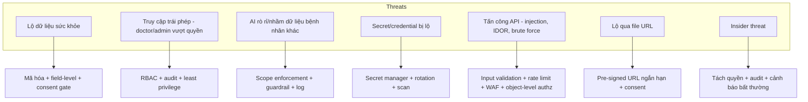
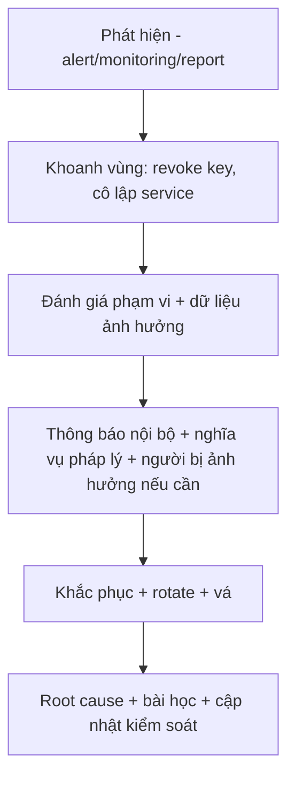

# Security & Compliance Framework — MetoCare

> Khung bảo mật và tuân thủ cho hệ thống xử lý dữ liệu sức khỏe nhạy cảm. Mọi yêu cầu ở đây nêu rõ **cơ chế**, không dừng ở "cần bảo mật". Tham chiếu: Luật Bảo vệ dữ liệu cá nhân Việt Nam (hiệu lực 01/01/2026), dữ liệu sức khỏe thuộc nhóm dữ liệu cá nhân nhạy cảm.

---

## 1. Purpose

Định nghĩa threat model, cách xử lý dữ liệu sức khỏe nhạy cảm, consent, RBAC, mã hóa, secrets, audit, retention, backup, breach response, kiểm soát truy cập admin/doctor/clinic, quản trị AI log, và checklist tuân thủ. Đây là chuẩn ràng buộc kỹ thuật và vận hành.

## 2. Context

- Dữ liệu sức khỏe = dữ liệu cá nhân nhạy cảm → yêu cầu nghiêm ngặt hơn về consent, kiểm soát truy cập, bảo mật, quản trị dữ liệu.
- Hệ thống có nhiều actor (patient, doctor, clinic, admin) và AI chạm dữ liệu → bề mặt tấn công lớn; cần phân quyền chặt + audit.
- Doctrine đã chốt: security-by-design, privacy-by-design, auditability.

## 3. Decision / Scope

**Decision:** Áp dụng phòng thủ nhiều lớp: TLS mọi nơi, mã hóa at-rest, field-level encryption cho dữ liệu sức khỏe nhạy cảm, RBAC + consent gate cho mọi truy cập dữ liệu bệnh nhân, audit log append-only, secret manager (không secret trong code/repo), backup có mã hóa + PITR, quy trình breach response. AI log được quản trị như dữ liệu nhạy cảm.

**Scope:** bảo mật ứng dụng + dữ liệu + vận hành + tuân thủ VN. **Out of scope:** chứng nhận quốc tế đầy đủ (HIPAA/GDPR formal certification) ở MVP — thiết kế tương thích nguyên tắc nhưng không cam kết chứng nhận giai đoạn này.

### 3.1 Threat Model Overview

## 4. Detailed Design / Requirements

### 4.1 Sensitive Health Data Handling
- Phân loại dữ liệu (xem `Data_Model_Overview.md`): public/internal/confidential/sensitive health.
- Thu thập tối thiểu; dữ liệu sức khỏe luôn gắn classification "sensitive".
- Không log PHI; không đưa PHI thật vào dev (xem `DevEnv_Hardening_Plan.md`).

### 4.2 Consent Management
- Consent có `consent_type`, `data_scope`, `granted_to`, hiệu lực (`valid_from/valid_until`), `revoked_at`.
- Onboarding bắt buộc consent rõ phạm vi; người dùng xem được ai đang có quyền và thu hồi bất kỳ lúc nào.
- Thu hồi → quyền truy cập tương ứng chấm dứt ngay; ghi audit.

### 4.3 RBAC
- Sáu role (Patient, Doctor, Clinic Admin, Internal Admin, Medical Reviewer, Super Admin) — quyền chi tiết ở `Technical_Architecture.md` 4.7.
- Least privilege: mặc định từ chối; chỉ cấp quyền cần thiết.
- **Object-level authorization** (chống IDOR): kiểm tra chủ sở hữu/relationship ở mọi resource, không chỉ check role.

### 4.4 Field-level Security & Encryption
- **At rest:** mã hóa storage (DB, object storage, backup). Field định danh/lâm sàng nhạy cảm thêm **field-level encryption** (mã hóa ở tầng ứng dụng, key từ secret manager).
- **In transit:** TLS 1.2+ bắt buộc mọi kết nối (client↔API, API↔DB/provider). HSTS.
- Trả dữ liệu theo role (data minimization ở response).

### 4.5 Secrets Management
- Secret ở secret manager (Vault/cloud), inject runtime; **không** trong code/Dockerfile/CI log/client app.
- Rotation định kỳ + rotate ngay khi lộ; secret-scan trong pre-commit + CI.

### 4.6 Audit Logging
- AuditLog append-only (không sửa/xóa): actor_type, actor_id, action, resource_type, resource_id, ip, device, timestamp.
- Ghi cho: mọi truy cập dữ liệu bệnh nhân, hành động AI lên dữ liệu, export báo cáo, thay đổi consent, hành động admin nhạy cảm.
- Audit không chứa nội dung nhạy cảm thô; lưu tách, bảo vệ chặt, có cảnh báo bất thường.

### 4.7 Data Retention
- Theo loại dữ liệu + nghĩa vụ pháp lý (xem `Data_Model_Overview.md` 4.4). Time-series cũ nén/lưu lạnh qua policy. Audit giữ lâu theo tuân thủ.

### 4.8 Backup & Restore
- Backup tự động DB + object storage, **mã hóa**, PITR cho Postgres.
- Kiểm thử restore định kỳ (restore drill). Backup lưu tách môi trường, kiểm soát truy cập + audit.

### 4.9 Breach Response

- Có runbook, người chịu trách nhiệm (incident owner), mốc thời gian thông báo theo yêu cầu pháp lý VN.

### 4.10 Admin Access Control
- Admin/Super Admin: MFA bắt buộc, least privilege, mọi hành động nhạy cảm audit.
- Truy cập dữ liệu bệnh nhân bởi admin phải có lý do + bị giới hạn + log; tách quyền để không một người vừa cấu hình vừa âm thầm đọc PHI.

### 4.11 Doctor / Clinic Access Control
- Bác sĩ chỉ thấy bệnh nhân **đã consent** với mình/phòng khám; object-level check.
- Clinic Admin quản lý vận hành phòng khám mình, không xem nội dung lâm sàng chi tiết ngoài phạm vi.
- Thu hồi consent/ngừng quan hệ → cắt quyền.

### 4.12 AI Log Governance
- AI log (AIConversation, safety_flags...) = dữ liệu nhạy cảm: RBAC chặt (Medical Reviewer/AI owner), audit khi xem, loại PII thô khi không cần.
- Dùng để review an toàn (xem `AI_Safety_Guardrail.md`), không cho mục đích ngoài.

### 4.13 Production Data Access Policy
- Mặc định **không** dev truy cập prod data. Truy cập prod (khi sự cố) cần phê duyệt, giới hạn thời gian, audit đầy đủ.
- Không sao chép prod data xuống dev/staging.

### 4.14 Development Data Policy
- Dev/staging dùng fake data generator; **không** PHI thật (xem `DevEnv_Hardening_Plan.md`).
- Secret-scan + cấm commit `.env`.

### 4.15 Compliance Checklist — Vietnam Personal Data Protection
- [ ] Xác định và phân loại dữ liệu cá nhân nhạy cảm (sức khỏe).
- [ ] Cơ chế consent rõ ràng, có thể thu hồi, lưu bằng chứng consent.
- [ ] Quyền chủ thể dữ liệu: truy cập, chỉnh sửa, xuất, xóa.
- [ ] Biện pháp kỹ thuật: mã hóa, RBAC, audit, kiểm soát truy cập.
- [ ] Quy trình breach response + nghĩa vụ thông báo.
- [ ] DPA với phòng khám/đối tác xử lý dữ liệu.
- [ ] Bổ nhiệm người phụ trách bảo vệ dữ liệu (nếu yêu cầu).
- [ ] Hồ sơ xử lý dữ liệu + đánh giá tác động khi cần.
- [ ] Tư vấn pháp lý dữ liệu cá nhân VN tham gia từ đầu.

### 4.16 Medical Disclaimer
- App hiển thị disclaimer rõ: MCP và AI hỗ trợ theo dõi sức khỏe, **không thay thế chẩn đoán/điều trị của bác sĩ**; trong trường hợp khẩn cấp liên hệ cơ sở y tế/cấp cứu. AI response luôn kèm disclaimer (xem `AI_Safety_Guardrail.md`).

### 4.17 Clinic/Doctor Partnership Data Agreement Checklist
- [ ] DPA (data processing agreement) ký với phòng khám/bác sĩ.
- [ ] Phạm vi dữ liệu được chia sẻ + mục đích rõ.
- [ ] Nghĩa vụ bảo mật + cấm dùng sai mục đích.
- [ ] Quy định khi chấm dứt: cắt quyền, xử lý dữ liệu.
- [ ] Trách nhiệm khi có sự cố + nghĩa vụ thông báo.
- [ ] Tuân thủ consent của bệnh nhân; không chia sẻ khi chưa đồng ý.

## 5. Risks

| Rủi ro | Giảm thiểu |
|--------|-----------|
| IDOR/truy cập vượt quyền | Object-level authz + consent gate + audit + test. |
| Secret lộ | Secret manager + scan + rotation. |
| Breach không phát hiện kịp | Monitoring + anomaly detection + audit + runbook. |
| Đối tác lạm dụng dữ liệu | DPA + scope + cắt quyền khi chấm dứt. |
| Vi phạm luật dữ liệu VN | Checklist tuân thủ + tư vấn pháp lý sớm. |
| AI log bị lạm dụng | RBAC chặt + audit + mục đích giới hạn. |

## 6. Acceptance Criteria

- [ ] TLS bắt buộc; mã hóa at-rest + field-level cho dữ liệu sức khỏe nhạy cảm.
- [ ] Mọi truy cập dữ liệu bệnh nhân qua RBAC + object-level + Consent + Audit (có test).
- [ ] Không secret trong repo/code/CI log; secret-scan xanh.
- [ ] Backup mã hóa + PITR + restore drill thành công.
- [ ] Breach runbook + incident owner tồn tại.
- [ ] Checklist tuân thủ VN có chủ sở hữu và tiến độ.
- [ ] DPA template sẵn cho đối tác.

## 7. Next Steps

1. Triển khai middleware RBAC + object-level authz + Consent + Audit.
2. Cấu hình mã hóa at-rest + field-level encryption + secret manager.
3. Thiết lập backup mã hóa + PITR + lịch restore drill.
4. Viết breach runbook + phân vai incident.
5. Làm việc với tư vấn pháp lý để hoàn thiện checklist VN + DPA template.
