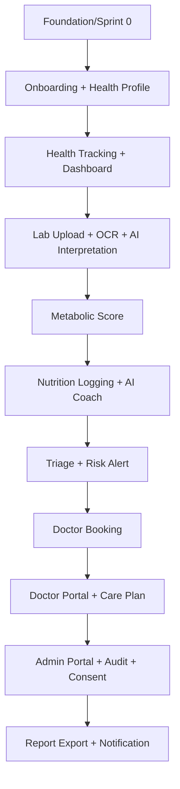

# Sprint 0 Execution Blueprint — Metabolic Care Platform

> Kế hoạch Sprint 0 (2–3 tuần) để team đặt nền kỹ thuật và sản phẩm trước khi vào sprint phát triển tính năng. Kết thúc Sprint 0, team phải "sẵn sàng để chạy nước rút" với nền tảng an toàn, có contract, có khung guardrail và backlog rõ.

---

## 1. Purpose

Định nghĩa mục tiêu, workstream, deliverable, task, DoR/DoD, acceptance và exit criteria cho Sprint 0. Tránh tình trạng bắt đầu code tính năng khi chưa có nền (repo, CI, schema, contract, guardrail, backlog).

## 2. Context

- Đã có doctrine + technical architecture. Cần biến thành nền chạy được.
- Dữ liệu sức khỏe nhạy cảm + AI rủi ro cao → Sprint 0 phải dựng sẵn consent/audit/security/guardrail ở mức khung, không để sau.
- Team đa năng: Product/BA, Architecture, Backend, Mobile, Web, AI/ML, DevOps, Security/Compliance, Medical Governance.

## 3. Decision / Scope

**Decision:** Sprint 0 kéo dài **2–3 tuần**, chạy song song 9 workstream, kết thúc bằng exit criteria cứng (mục 8). Không xây tính năng người dùng hoàn chỉnh; chỉ dựng nền, "walking skeleton" và khung an toàn.

### 3.1 Sprint 0 Objectives

1. Repo, môi trường dev, CI/CD baseline chạy được (theo `DevEnv_Hardening_Plan.md`).
2. "Walking skeleton": Flutter ↔ FastAPI ↔ Postgres chạy 1 luồng auth + 1 endpoint dữ liệu có Consent + Audit.
3. Initial DB schema + initial API contract (OpenAPI) cho module P0.
4. Khung AI safety: safety prompt template + triage rule engine skeleton + LLM Gateway stub.
5. Khung Doctor Portal + Admin Portal (Next.js) đăng nhập + 1 màn hình danh sách.
6. MVP backlog skeleton + DoR/DoD + acceptance template.
7. Medical governance khởi động: red flag list v0 do bác sĩ duyệt.

**Out of scope Sprint 0:** OCR thật, AI lab interpretation hoàn chỉnh, payment thật, video, nutrition đầy đủ, care plan đầy đủ.

## 4. Detailed Design / Requirements

### 4.1 Workstreams & Deliverables

#### WS1 — Product / BA
- Deliverables: BRD v1 chốt (`BRD.md`), Product Module Map (`Product_Module_Map.md`), MVP backlog skeleton, user journey P0, success metrics nháp.
- Tasks: chốt persona & scope MVP; viết user story P0 (onboarding, tracking, lab upload, AI lab explain, metabolic score, booking, doctor portal); xác định KPI; lập backlog có P0/P1/P2.

#### WS2 — Architecture
- Deliverables: ADR-001→009, sơ đồ context/container/module (đã có ở `Technical_Architecture.md`), ranh giới module, chuẩn API.
- Tasks: viết ADR cho mỗi quyết định công nghệ; định nghĩa module boundary; chuẩn OpenAPI + error format; quy ước versioning.

#### WS3 — Backend
- Deliverables: skeleton FastAPI modular monolith; middleware Auth/RBAC/Consent/Audit; Alembic migration đầu tiên; 1 luồng dữ liệu end-to-end.
- Tasks: dựng app + module layout; Auth (JWT + refresh); decorator Consent + Audit; initial schema migration; endpoint mẫu `POST /health-metrics` + `GET /health-metrics` có gate.

#### WS4 — Mobile (Flutter)
- Deliverables: app skeleton, theme/design system khung, màn onboarding/login, màn nhập 1 chỉ số + xem biểu đồ mock.
- Tasks: cấu trúc project + state management; gọi API auth; form nhập chỉ số; chart component; gắn API contract.

#### WS5 — Web Portal (Next.js)
- Deliverables: Doctor Portal + Admin Portal skeleton, login + layout, 1 màn danh sách bệnh nhân/booking mock.
- Tasks: dựng Next.js + Tailwind + design system; auth flow; route guard theo role; màn danh sách + summary 1 trang khung.

#### WS6 — AI / ML
- Deliverables: LLM Gateway stub (provider abstraction + logging), safety prompt template v1, triage rule engine skeleton (red flag list v0), RAG corpus skeleton (vài guideline mẫu đã duyệt), AI log schema.
- Tasks: gateway interface + mock provider; safety prompt + disclaimer; rule engine đọc red flag list; ingest vài doc vào pgvector; định nghĩa `safety_flags`.

#### WS7 — DevOps
- Deliverables: docker-compose, Makefile, .env.example, pre-commit, CI (lint/test/migrate/build/secret-scan), staging skeleton.
- Tasks: compose hạ tầng + mock services; pipeline CI; secret scan; deploy staging walking skeleton.

#### WS8 — Security / Compliance
- Deliverables: data classification v1, RBAC matrix, consent model v1, audit log spec, threat model nháp, compliance checklist VN (theo `Security_Compliance_Framework.md`).
- Tasks: phân loại dữ liệu; định nghĩa consent_type/data_scope; spec audit fields; review luồng dữ liệu nhạy cảm; medical disclaimer text.

#### WS9 — Medical Governance
- Deliverables: red flag symptom list v0 (đã duyệt), allowed/prohibited AI actions v1, escalation policy v0, thành phần medical board.
- Tasks: bác sĩ duyệt red flag; chốt ranh giới AI; định nghĩa case cần human-in-the-loop; lập lịch review định kỳ.

### 4.2 Task breakdown (các task nền bắt buộc)

| Task | WS | Output |
|------|----|--------|
| Initial database schema | WS3+WS8 | Migration đầu (User, PatientProfile, HealthMetric, Consent, AuditLog) |
| Initial API contract | WS2+WS3 | OpenAPI cho Auth, Profile, Health Records, Consent |
| Initial UI wireframe | WS1+WS4+WS5 | Wireframe onboarding, tracking, doctor summary, admin list |
| Initial AI safety prompt | WS6+WS9 | Safety prompt template + disclaimer + prohibited list |
| Initial triage rule engine | WS6+WS9 | Rule engine skeleton + red flag list v0 |
| Initial doctor portal | WS5 | Login + danh sách bệnh nhân + summary 1 trang khung |
| Initial audit/consent | WS3+WS8 | Middleware Consent + Audit gắn vào endpoint mẫu |

### 4.3 Definition of Ready (DoR)

Một story sẵn sàng vào sprint khi: có mô tả rõ giá trị người dùng; có acceptance criteria; có ràng buộc y tế/AI/bảo mật nếu liên quan; có ước lượng; phụ thuộc đã xác định; không vi phạm doctrine; đã rõ dữ liệu cần và phân loại.

### 4.4 Definition of Done (DoD)

Một story hoàn thành khi: code qua lint/test/build gate; có test (gồm test consent/audit nếu chạm dữ liệu bệnh nhân); review xanh (2 reviewer nếu chạm dữ liệu sức khỏe/AI/security); không secret/PHI; cập nhật contract/doc; với AI: đi qua guardrail và có log; deploy được lên staging; checklist doctrine compliance đạt.

### 4.5 Acceptance Criteria (Sprint 0 level)

- Walking skeleton chạy: đăng nhập từ Flutter, ghi 1 chỉ số qua API có Consent + Audit, xem lại được.
- CI gate xanh trên repo.
- OpenAPI contract module P0 tồn tại và được client tham chiếu.
- Triage rule engine skeleton phát hiện được red flag mẫu và trả escalation.
- Doctor Portal + Admin Portal login được và hiển thị danh sách mock.
- Red flag list v0 được bác sĩ ký duyệt.

### 4.6 MVP backlog skeleton (epic)

## 5. Risks & Blockers

| Rủi ro/Blocker | Giảm thiểu |
|----------------|-----------|
| Chưa có bác sĩ duyệt red flag → triage không khởi động được | Ưu tiên WS9 ngay tuần 1; có danh sách red flag tham chiếu chuẩn để bác sĩ duyệt nhanh. |
| Contract chậm → mobile/web bị block | API-first; ưu tiên contract module P0 trước trong tuần 1. |
| CI/môi trường dev chưa xong → dev không chạy được | DevOps là đường găng; ưu tiên compose + CI tuần 1. |
| Phạm vi Sprint 0 phình ra | Giữ nguyên scope "skeleton + khung an toàn", từ chối thêm tính năng. |
| Thiếu người cross-skill (AI + medical) | Pair WS6 và WS9; đặt lịch review chung. |

## 6. Acceptance Criteria (exit gate tóm tắt)

- [ ] Mọi deliverable theo workstream ở mục 4.1 hoàn thành tối thiểu mức skeleton.
- [ ] 7 task nền (mục 4.2) hoàn thành.
- [ ] DoR/DoD/Acceptance template được team thống nhất.
- [ ] Backlog có story P0 với DoR đạt cho sprint kế.

## 7. Sprint 0 Exit Criteria

1. Repo + CI + dev env chạy được; walking skeleton xanh trên staging.
2. Schema + OpenAPI contract P0 tồn tại; consent + audit hoạt động trên endpoint mẫu.
3. LLM Gateway stub + safety prompt + triage rule skeleton + red flag list v0 (đã duyệt) tồn tại.
4. Doctor Portal + Admin Portal login + danh sách.
5. BRD v1, Module Map, MVP backlog skeleton, DoR/DoD chốt.
6. Security: data classification, RBAC matrix, consent model, audit spec v1.
7. Go/No-Go review với Founder/CTO/Medical lead → quyết định bắt đầu Sprint 1.

## 8. Next Steps

1. Lên lịch 2–3 tuần với chủ đề tuần: T1 nền + contract, T2 skeleton end-to-end, T3 hardening + backlog + exit review.
2. Phân công owner từng workstream.
3. Daily theo workstream + sync tích hợp 2 lần/tuần.
4. Tổ chức Sprint 0 review + Go/No-Go.
