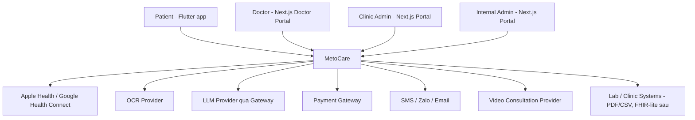
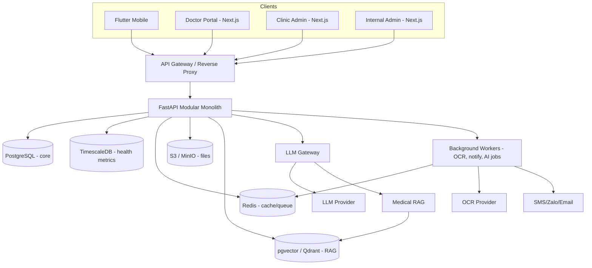
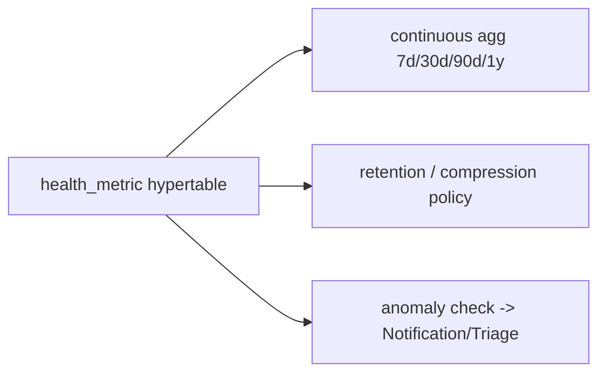
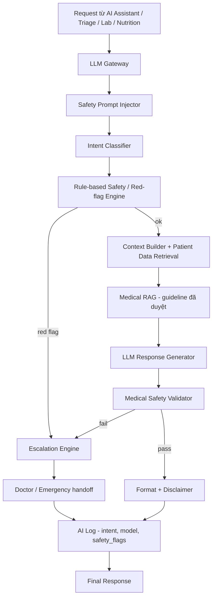
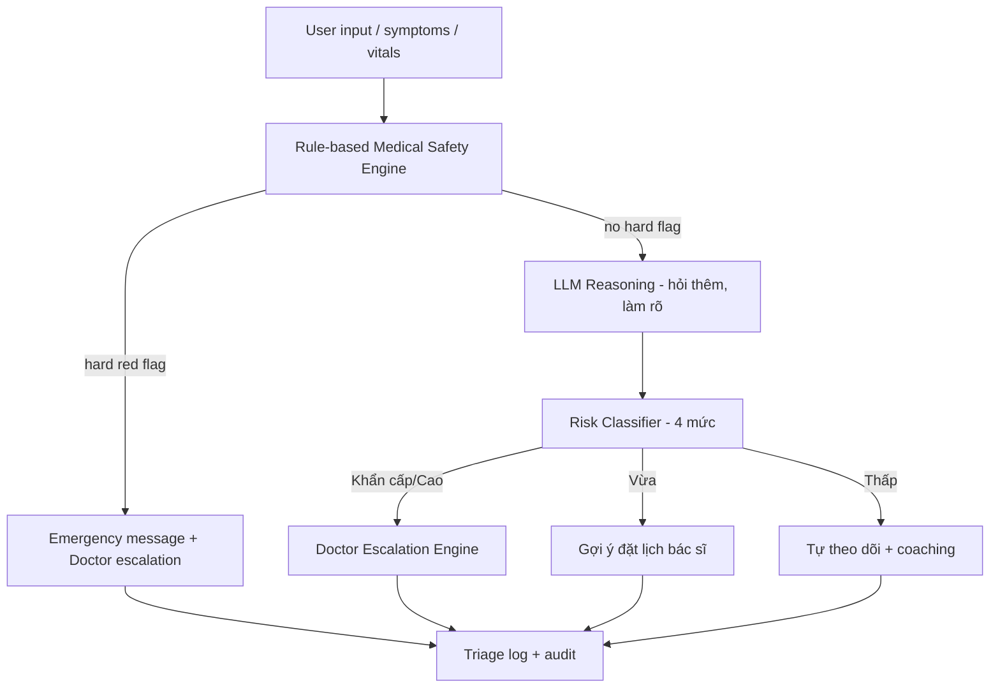
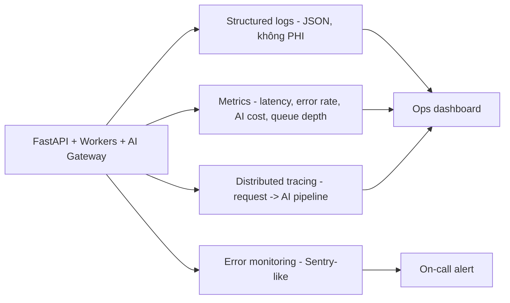
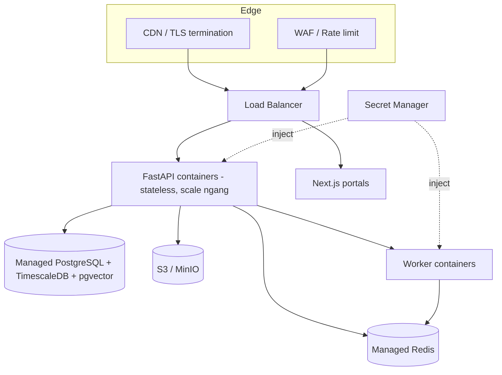

# Technical Architecture — MetoCare

> Kiến trúc kỹ thuật chi tiết để team bắt đầu thiết kế và xây dựng hệ thống. Tài liệu này cụ thể hóa `Architecture_Doctrine.md` thành module, data layer, AI layer, integration, RBAC, observability và deployment.

---

## 1. Purpose

Mô tả kiến trúc kỹ thuật MVP của MCP ở mức đủ chi tiết để Backend/Mobile/Web/AI/DevOps bắt đầu thiết kế schema, API contract và pipeline. Chốt cấu trúc module, ranh giới, công nghệ, luồng dữ liệu và đường scale.

## 2. Context

- Doctrine đã chốt: modular monolith, API-first, FastAPI + PostgreSQL/TimescaleDB + Redis + S3/MinIO + pgvector, Flutter mobile, Next.js portals, LLM Gateway.
- Hệ thống xử lý dữ liệu sức khỏe nhạy cảm → consent/audit/RBAC là tầng bắt buộc.
- AI phải đi qua guardrail; triage là mô hình lai rule + LLM.

## 3. Decision / Scope

**Decision:** Backend là một FastAPI modular monolith với 15 module nghiệp vụ + 2 cross-cutting (Consent, Audit). Dữ liệu chia 5 store (Postgres, TimescaleDB hypertable, Redis, S3/MinIO, pgvector). AI là pipeline nhiều bước qua LLM Gateway, không gọi LLM trực tiếp. Triage là rule engine + LLM + classifier + escalation.

**Scope:** kiến trúc MVP + đường scale. **Out of scope:** chi tiết schema từng bảng (xem `Data_Model_Overview.md`), chi tiết guardrail (xem `AI_Safety_Guardrail.md`), hạ tầng prod chi tiết (CI/CD ở `DevEnv_Hardening_Plan.md`).

### 3.1 System Context Diagram

### 3.2 Container Diagram

## 4. Detailed Design / Requirements

### 4.1 Backend modules

| Module | Trách nhiệm chính | Dữ liệu sở hữu |
|--------|-------------------|----------------|
| **Auth & Identity** | Đăng ký/đăng nhập, JWT/refresh, MFA cho doctor/admin, quản lý role. | User, Session, Role |
| **Patient Profile** | Hồ sơ bệnh nhân, bệnh nền, dị ứng, tiền sử, lifestyle, risk segment, family profile. | PatientProfile |
| **Health Records** | Ghi/đọc chỉ số sức khỏe time-series, normal range, status, biểu đồ xu hướng, cảnh báo bất thường. | HealthMetric (TimescaleDB) |
| **Lab OCR & Interpreter** | Upload ảnh/PDF xét nghiệm → OCR → trích LabResult → AI Lab Interpreter giải thích. | LabDocument, LabResult |
| **Nutrition** | Meal log (ảnh + chọn nhanh), ước lượng rủi ro, gợi ý hành vi, activity/sleep/habit, thử thách 7/30/90 ngày. | MealLog, ActivityLog |
| **AI Assistant** | Health assistant, lab explainer, nutrition coach, doctor summary generator — đều qua pipeline guardrail. | AIConversation, AIRecommendation |
| **Triage** | Rule engine red flag + LLM hỏi thêm + risk classifier + escalation. | RiskScore, TriageEvent |
| **Doctor Booking** | Tìm bác sĩ/phòng khám, đặt lịch online/offline, gửi hồ sơ trước, đánh giá. | Appointment, Availability |
| **Teleconsultation** | Phòng chat/video, lưu consultation note, link tới appointment. | ConsultationNote |
| **Clinic Portal** | Quản lý bác sĩ, lịch, booking, bệnh nhân từ app, gói chăm sóc, doanh thu, SLA. | Clinic, ClinicStaff |
| **Payment** | Thanh toán booking/subscription/gói; trạng thái giao dịch. | Payment |
| **Notification** | Nhắc đo chỉ số, lịch hẹn, cảnh báo, weekly report qua push/SMS/Zalo/Email. | Notification |
| **Consent** (cross-cutting) | Quản lý consent, phạm vi dữ liệu, cấp/thu hồi; gate mọi truy cập dữ liệu bệnh nhân. | Consent |
| **Audit** (cross-cutting) | Ghi audit log không sửa được cho mọi truy cập/hành động AI lên dữ liệu sức khỏe. | AuditLog |
| **Analytics** | Metrics sản phẩm/lâm sàng/vận hành cho admin dashboard (trên dữ liệu được phép). | Aggregations |

Ranh giới: module chỉ gọi nhau qua service interface; Consent + Audit là middleware/decorator áp lên mọi truy cập `PatientProfile/HealthMetric/LabResult/...`.

### 4.2 Data layer

**PostgreSQL (core):** dữ liệu giao dịch — user, profile, lab, appointment, consultation note, care plan, consent, payment, notification, audit. Là source of truth quan hệ.

**TimescaleDB (time-series):** `health_metric` là **hypertable** phân mảnh theo thời gian. Lý do: ghi nhiều theo thời gian, query theo cửa sổ 7/30/90/365 ngày, dùng continuous aggregate cho biểu đồ xu hướng, retention policy cho dữ liệu cũ. Là extension trên cùng cụm Postgres → join được với core.

**Object storage (S3/MinIO):** file xét nghiệm gốc (ảnh/PDF), báo cáo PDF xuất cho bác sĩ, ảnh bữa ăn. DB chỉ lưu key + metadata + classification, không lưu blob. URL truy cập là pre-signed, ngắn hạn, gắn consent.

**Redis:** cache hồ sơ/biểu đồ, session, rate-limit, queue cho background job (OCR, AI summary, notification).

**Vector DB (pgvector → Qdrant):** embedding của Medical RAG knowledge (guideline đã duyệt, tài liệu giáo dục, FAQ, policy AI). MVP dùng pgvector (cùng Postgres); chuyển Qdrant khi corpus/QPS lớn.

### 4.3 AI layer

| AI engine | Vai trò | Ranh giới |
|-----------|---------|-----------|
| **LLM Gateway** | Abstraction provider, gắn safety prompt, log, fallback, cost/rate control. | Không business logic gọi LLM trực tiếp. |
| **Medical RAG** | Cung cấp tri thức từ guideline nội bộ đã được bác sĩ duyệt. | Không lấy tri thức tự do từ internet. |
| **Safety Guardrail** | Rule engine 2 đầu input/output. | Chặn chẩn đoán khẳng định, kê đơn, đổi liều. |
| **Triage Rule Engine** | Phát hiện red flag cứng trước LLM. | Quyết định escalate, không để LLM tự quyết. |
| **Lab Interpreter** | Giải thích kết quả xét nghiệm dễ hiểu, nêu ý nghĩa và mức cần lưu ý. | Không kết luận chẩn đoán; gợi ý gặp bác sĩ khi bất thường. |
| **Nutrition Coach** | Gợi ý lối sống/ăn uống theo món Việt, low-friction. | Không phác đồ điều trị; chỉ khuyến nghị lối sống. |
| **Doctor Summary Generator** | Tạo pre-consult summary 1 trang cho bác sĩ. | Là tóm tắt dữ liệu, không thay đánh giá lâm sàng. |

### 4.4 Triage architecture (mô hình lai)

4 mức rủi ro: Thấp (tự theo dõi) → Vừa (nên gặp bác sĩ) → Cao (cần gặp sớm) → Khẩn cấp (escalate/cấp cứu). Red flag ví dụ: đau ngực/khó thở/vã mồ hôi, huyết áp rất cao kèm đau đầu/đau ngực, đường huyết rất cao kèm nôn/mệt lả, ngất/yếu liệt/nói khó, đau bụng dữ dội kéo dài, hạ đường huyết nặng. Chi tiết tại `AI_Safety_Guardrail.md`.

### 4.5 External integrations

| Tích hợp | MVP | Cách làm |
|----------|-----|----------|
| Apple Health / Google Health Connect | Phase sau (đọc cơ bản) | SDK trên Flutter, đồng bộ chỉ số có consent. |
| OCR | MVP | Provider OCR qua worker; có mock ở dev; trả LabResult + confidence. |
| Payment gateway | MVP (booking/subscription) | Cổng nội địa (vd VNPay/Momu/thẻ); idempotent; webhook xác nhận. |
| SMS / Zalo / Email | MVP | Notification module; provider abstraction; mock ở dev. |
| Video consultation | MVP cơ bản | Provider tạo room; link gắn appointment; không tự lưu video trừ khi có consent. |
| Lab / clinic systems | Phase 2–3 | Bắt đầu PDF/CSV import/export; FHIR-lite về sau; FHIR đầy đủ khi tích hợp bệnh viện lớn. |

### 4.6 API design principles

- REST/JSON, OpenAPI-first, version `/api/v1`.
- Resource-oriented, phân trang chuẩn, lỗi theo format thống nhất (code, message, trace_id).
- Idempotency key cho thao tác thanh toán/booking.
- Mọi endpoint dữ liệu bệnh nhân: kiểm tra auth → RBAC → Consent → ghi Audit.
- Rate-limit qua Redis; pre-signed URL cho file.

### 4.7 Authentication / Authorization

- **AuthN:** JWT access token ngắn hạn + refresh token; MFA bắt buộc cho Doctor/Clinic Admin/Internal Admin/Super Admin. Password hash bằng Argon2/bcrypt.
- **AuthZ:** RBAC + kiểm tra ngữ cảnh (bác sĩ chỉ thấy bệnh nhân đã consent với mình/phòng khám của mình).
- **Field-level security:** field nhạy cảm (vd chẩn đoán, định danh) có thể mã hóa field-level; trả về theo role.

#### RBAC roles

| Role | Quyền chính | Giới hạn |
|------|-------------|----------|
| **Patient** | Quản lý dữ liệu của mình, cấp/thu hồi consent, đặt lịch, chat với AI/bác sĩ, xuất báo cáo. | Chỉ dữ liệu của mình (và family profile được ủy quyền). |
| **Doctor** | Xem hồ sơ bệnh nhân **đã consent**, xem AI summary, ghi consultation note, tạo care plan, đề xuất xét nghiệm, chat follow-up. | Không xem ngoài phạm vi consent; không truy cập admin. |
| **Clinic Admin** | Quản lý bác sĩ/lịch/booking/gói/doanh thu/SLA của phòng khám. | Không xem nội dung lâm sàng chi tiết ngoài phạm vi cho phép; chỉ trong phòng khám mình. |
| **Internal Admin** | Vận hành nền tảng: quản lý user/bác sĩ/phòng khám/booking, xem AI logs, dashboard, audit. | Không sửa dữ liệu lâm sàng; truy cập dữ liệu bệnh nhân bị giới hạn & audit. |
| **Medical Reviewer** | Duyệt nội dung y tế/RAG, review AI logs, ký guardrail. | Quyền theo nhiệm vụ review, không quyền vận hành hệ thống. |
| **Super Admin** | Cấu hình hệ thống, quản trị role, khóa/mở. | Hành động nhạy cảm cần MFA + audit; tách quyền (không tự ý đọc PHI mà không có lý do + log). |

### 4.8 Observability

- **Logging:** có cấu trúc, gắn `trace_id`, **không log PHI/secret**.
- **Metrics:** latency p95/p99 theo endpoint, error rate, AI token/cost, queue depth, triage escalation rate.
- **Tracing:** trace xuyên suốt request → AI pipeline (intent → guardrail → LLM → validator).
- **Error monitoring:** capture exception + cảnh báo on-call cho lỗi nghiêm trọng (đặc biệt guardrail/triage fail).

### 4.9 Deployment architecture (MVP)

- MVP: một region, backend stateless scale ngang sau LB, DB managed có backup/PITR, secrets từ secret manager, TLS bắt buộc.
- Tách biệt môi trường dev/staging/prod; prod data không vào dev.

### 4.10 Future scaling path

1. Tách **AI Gateway/Worker** thành service riêng khi tải AI lớn.
2. Tách **Lab OCR** và **Notification** thành worker pool độc lập.
3. Chuyển vector store sang **Qdrant** khi RAG corpus/QPS tăng.
4. Tách **Health Records (time-series)** thành cụm Timescale riêng + read replica.
5. Khi cần độc lập triển khai theo team/domain → bóc module thành microservice theo ranh giới đã có (Auth, Booking, Teleconsult...).
6. Multi-region + FHIR integration khi tích hợp bệnh viện lớn.

## 5. Risks

| Rủi ro | Mức | Giảm thiểu |
|--------|-----|-----------|
| Coupling chéo module phá vỡ monolith | TB | Service interface + review + cấm cross-module DB. |
| AI pipeline latency cao | TB | Cache RAG, async worker, streaming, timeout + fallback. |
| Time-series phình to | TB | Hypertable + compression + retention + continuous aggregate. |
| OCR sai dẫn tới lab result sai | Cao | `ocr_confidence`, yêu cầu người dùng/bác sĩ verify, không tự kết luận. |
| Rò rỉ qua file URL | Cao | Pre-signed URL ngắn hạn + consent + audit. |
| Provider ngoài downtime | TB | Abstraction + retry + circuit breaker + fallback message. |

## 6. Acceptance Criteria

- [ ] Có OpenAPI contract cho từng module trước khi code UI.
- [ ] `health_metric` triển khai dưới dạng TimescaleDB hypertable với continuous aggregate cho 7/30/90/365 ngày.
- [ ] Không có code path gọi LLM ngoài LLM Gateway.
- [ ] Triage chạy rule engine **trước** LLM; red flag cứng escalate không phụ thuộc LLM.
- [ ] Mọi endpoint dữ liệu bệnh nhân: auth → RBAC → Consent → Audit, có test chứng minh.
- [ ] Observability: structured log (no PHI), metrics, tracing, error monitoring hoạt động trên staging.
- [ ] Deployment MVP: backend stateless scale ngang, secrets từ secret manager, TLS bắt buộc.

## 7. Next Steps

1. Viết OpenAPI contract cho module P0 (Auth, Profile, Health Records, Lab, AI Assistant, Triage, Booking, Doctor Portal, Consent, Audit).
2. Thiết kế schema chi tiết theo `Data_Model_Overview.md`.
3. Dựng skeleton modular monolith + middleware Consent/Audit.
4. Triển khai LLM Gateway + guardrail stub + triage rule engine khung.
5. Dựng deployment staging theo sơ đồ 4.9.
